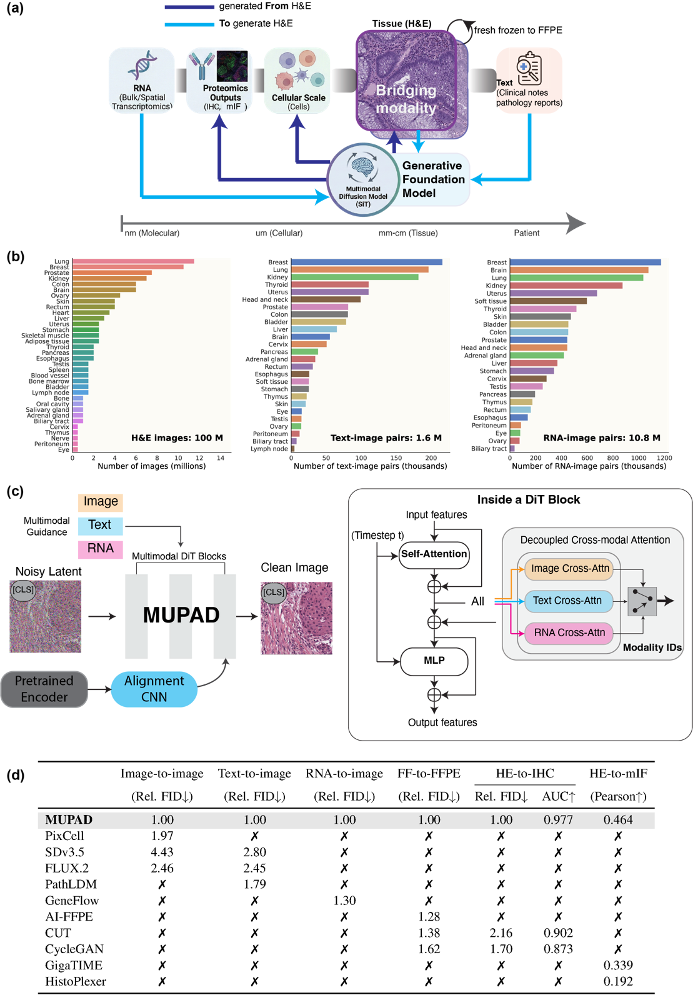
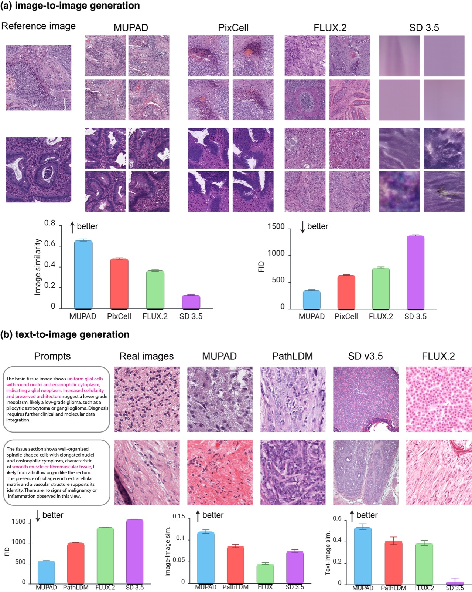
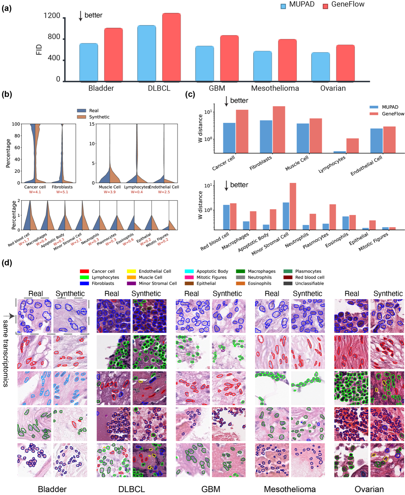
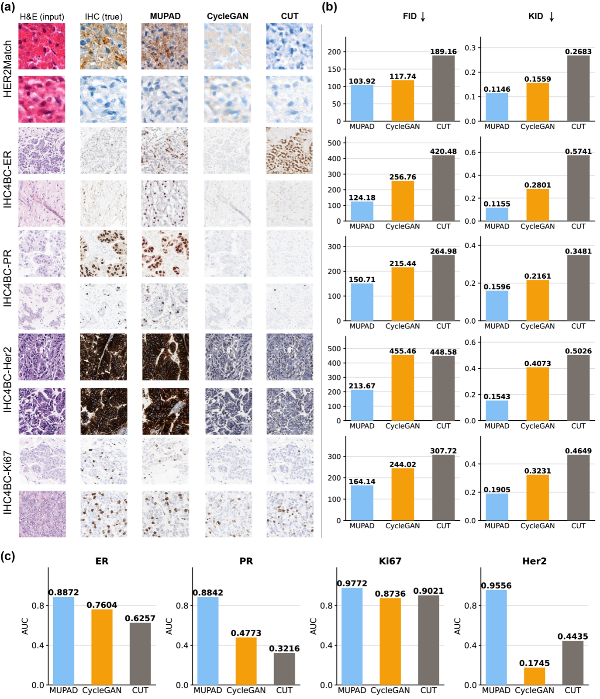

# A Generative Foundation Model for Multimodal Histopathology

> **Bibkey** `Xiang2026_260403635` · **Venue** arXiv preprint (2026) · **Category** foundation · **Relevance** medium · **Access** open
> **Link** <https://arxiv.org/abs/2604.03635> · `status: complete`

---

## One-liner
MuPD (Multimodal Pathology Diffusion) is a generative pathology foundation model that embeds H&E histology, RNA molecular profiles, and clinical text into a shared latent space, using one diffusion transformer to serve text-/image-/RNA-conditioned cross-modal synthesis and virtual staining.

## Problem
Diagnosis of complex disease needs integrated histological, molecular, and clinical data, but these modalities are routinely incomplete due to tissue scarcity, assay cost, and workflow constraints. Prior imputation methods are task-specific models trained on narrow single source→target pairs and generalize poorly. Can one unified generative model, pretrained at scale across heterogeneous pathology modalities, outperform specialized alternatives?

## Method
A Diffusion/SiT (Scalable Interpolant Transformer) backbone with H&E as the bridging modality. Key components: (1) Decoupled Cross-Attention (DCA) — text, RNA, and reference-image conditions each flow through independent parallel attention streams queried by intermediate image representations, avoiding competition in a shared KV space; (2) feature alignment — a lightweight CNN projector aligns internal features to the pretrained pathology encoder Virchow2, plus an auxiliary CLS-token denoising loss for global semantics. Frozen VAE with 8× downsampling; AdamW on 8× H100 up to 500K steps in bfloat16; classifier-free guidance with 10% condition dropout. RNA is TPM-normalized then compressed to 331 pathway-level enrichment scores via pan-cancer signatures.

## Data
Pretraining: 100M H&E patches (512×512, 20×; TCGA, GTEx, PAIP, PLCO); 1.6M text–image pairs (PathGen-1.6M); 10.8M RNA–image pairs (TCGA bulk RNA-seq linked to matched WSIs), spanning 34 human organs. Evaluation: HISTAI, PathMMU, SkinCancer, PanNuke, UniToPatho, LC25000, SICAPv2, MOSAIC spatial transcriptomics, TCGA, HER2Match, IHC4BC, ORION colorectal cancer.

## Key results
Image→image FID 305.12 vs PixCell 602.45 (~49%), similarity 0.63 vs 0.46. Text→image FID 576.30 vs PathLDM 1029.62 (~44%), alignment 0.53 vs 0.41. Augmentation: PanNuke 10-shot 0.492→0.724 (+47.2%), SkinCancer 0.790→0.850; large retrieval R@10 gains. Spatial-transcriptomics→H&E (5 cancers): bladder FID 724.6 vs GeneFlow 1012.5 (~28%), lower cell-type Wasserstein distances. Frozen→FFPE (lung) FID 323.7 vs AI-FFPE 435.3 (~26%). H&E→IHC: ER FID 124.18 vs CycleGAN 256.76; clinical AUC Ki67 0.9772, HER2 0.9556. H&E→mIF: patch PCC 0.238 vs GigaTIME 0.198; slide-level 0.464 vs 0.339; PD-L1 patch PCC 0.218. Ablations: shared attention worsens FID 7.9–13.6%; CNN spatial + CLS denoising beats REPA (0.424 vs 0.243).

## Contributions
  A single unified generative FM covering H&E/RNA/text/IHC/mIF with minimal or no task-specific fine-tuning; reframes disparate tasks as projections of one shared cross-modal biological distribution.
  Decoupled Cross-Attention keeps heterogeneous conditions in separate streams instead of a shared KV space (validated by ablation).
  Virchow2 feature alignment plus CLS-token denoising for semantic/pathological fidelity; very large-scale pretraining (100M patches, 34 organs).

## Limitations
  Diffusion is inherently stochastic; may hallucinate anatomically implausible outputs under distribution shift.
  Computational biomarkers need prospective concordance validation vs. lab assays; positioned as hypothesis-generating, not diagnostic.
  RNA conditioning is bulk (not single-cell/high-res spatial) and compressed to 331 pathway scores, losing gene-level detail; no stated public code/weights.

## Relation to our direction
This sits mainly in the **virtual-tissue modeling** stage and touches the **gene→tissue-phenotype** link. It shows morphology encodes molecular information: RNA/pathway conditions generate H&E that preserves cell-type distributions, and H&E maps back to IHC/mIF immune-marker localization. For us: (1) as a generative "virtual tissue" engine that synthesizes tissue images under molecular/pathway conditions — if perturbations are cast as conditions, it could in principle simulate revert (how tissue morphology shifts after a gene/pathway change), a candidate for gene-revert hypothesis generation; (2) DCA's multimodal conditioning transfers to our spatial-omics conditioning; (3) but it does **forward generation/imputation only** — no explicit **anomaly detection**, and it does not output "which genes to modulate to revert an anomaly"; we would need to bolt on anomaly scoring and inverse optimization. Net: strong virtual-tissue backbone, weak on the anomaly-detection and causal gene-revert stages.

## Reusable assets
Model/code/weights: not explicitly released in the paper (confirm with authors / later version). Reusable external assets & protocols: pretrained encoder **Virchow2** (alignment target); **PathGen-1.6M** text–image pairs; **TCGA/GTEx/PAIP/PLCO** H&E; **MOSAIC** spatial transcriptomics; classification benchmarks **PanNuke/UniToPatho/LC25000/SICAPv2/SkinCancer**; virtual-staining benchmarks **IHC4BC/HER2Match/ORION**. Reusable eval protocols: FID/KID + text–image alignment, few-shot (10-shot) classification lift, cell-type Wasserstein distance, marker PCC (patch/slide), IHC clinical AUC (Ki67/HER2). Reusable method pieces: SiT diffusion backbone, Decoupled Cross-Attention, CNN+CLS-token alignment loss, RNA→331-pathway-score encoding.

## Follow-ups
  Check for code/checkpoint release in later versions and the Ruijiang Li lab page.
  Read baselines: Virchow2, PixCell, GeneFlow, PathLDM, AI-FFPE, GigaTIME, HistoPlexer.
  How the 331 pathway signatures are built; feasibility of single-cell/spatial-resolution conditioning.
  Can perturbation/revert be cast as a condition + anomaly scoring + inverse optimization on top of MuPD.

## Figures & tables


**Fig 1.** Study overview: (a) the MuPD framework with H&E as the bridging modality integrating transcriptomics/proteomics, tissue architecture, and clinical text for cross-scale synthesis; (b) 34-organ pretraining corpus (100M H&E patches, 1.6M text–image, 10.8M RNA–image pairs); (c) DiT with decoupled cross-modal attention (DCA) processing image/text/RNA conditioning in parallel streams; (d) benchmarking against other methods.
_Source: https://arxiv.org/html/2604.03635v1/figs/fig1-overview.png  ·  License: arXiv (author-posted preprint)_


**Fig 2.** Image- and text-conditioned generation: (a) image-to-image generation where MuPD preserves authentic biological structures with higher fidelity than baselines; (b) text-to-image generation reconstructing fine-grained histological features from text prompts.
_Source: https://arxiv.org/html/2604.03635v1/figs/fig2-text2image-image2image.png  ·  License: arXiv (author-posted preprint)_


**Fig 3.** H&E generation from spatial transcriptomics: (a) FID across five cancer types; (b) cell-type composition in synthetic vs. real images (Wasserstein distance); (c) Wasserstein-distance comparison between MuPD and GeneFlow; (d) representative real/synthetic H&E pairs conditioned on matched spatial transcriptomics.
_Source: https://arxiv.org/html/2604.03635v1/figs/fig5-st2image.png  ·  License: arXiv (author-posted preprint)_


**Fig 4.** Virtual H&E-to-IHC translation and clinical validation: (a) multi-stain virtual IHC examples; (b) FID and KID for distributional fidelity and perceptual quality; (c) clinical utility on IHC4BC predicting ground-truth biomarkers by AUC.
_Source: https://arxiv.org/html/2604.03635v1/figs/fig6-he2ihc.png  ·  License: arXiv (author-posted preprint)_

### Results

**Table 1.** Headline cross-modal generation results: MuPD vs. the next-best baseline per task (lower FID is better; higher similarity/alignment is better).

| Task | Metric | MuPD | Best baseline | Rel. gain |
|---|---|---|---|---|
| Image → image | FID ↓ | 305.12 | 602.45 (PixCell) | ~49% |
| Image → image | Similarity ↑ | 0.63 | 0.46 (PixCell) | — |
| Text → image | FID ↓ | 576.30 | 1029.62 (PathLDM) | ~44% |
| Text → image | Text–image alignment ↑ | 0.53 | 0.41 (PathLDM) | — |
| Spatial transcriptomics → H&E (bladder) | FID ↓ | 724.6 | 1012.5 (GeneFlow) | ~28% |
| Frozen → FFPE (lung) | FID ↓ | 323.7 | 435.3 (AI-FFPE) | ~26% |
| H&E → IHC (ER marker) | FID ↓ | 124.18 | 256.76 (CycleGAN) | ~52% |
| H&E → mIF | Patch PCC ↑ | 0.238 | 0.198 (GigaTIME) | ~20% |
| H&E → mIF | Slide-level PCC ↑ | 0.464 | 0.339 (GigaTIME) | ~37% |

**Table 2.** Downstream value: synthetic-data augmentation for few-shot classification (10-shot accuracy) and virtual-staining clinical utility (AUC).

| Evaluation | Metric | Baseline / w-MuPD |
|---|---|---|
| PanNuke, 10-shot | Accuracy ↑ | 0.492 → 0.724 (+47.2%) |
| SkinCancer, 10-shot | Accuracy ↑ | 0.790 → 0.850 |
| H&E → IHC, Ki67 | Clinical AUC ↑ | 0.9772 |
| H&E → IHC, HER2 | Clinical AUC ↑ | 0.9556 |

_Source: https://arxiv.org/abs/2604.03635 (arXiv HTML v1)  ·  License: arXiv (author-posted preprint). Numerical values are faithfully transcribed from the paper text._

## Cite
```bibtex
@misc{Xiang2026_260403635,
  title = {A Generative Foundation Model for Multimodal Histopathology},
  author = {Jinxi Xiang and Mingjie Li and Siyu Hou and Yijiang Chen and Xiangde Luo and Yuanfeng Ji and Xiang Zhou and Ehsan Adeli and Akshay Chaudhari and Curtis P. Langlotz and Kilian M. Pohl and Ruijiang Li},
  year = {2026},
  eprint = {2604.03635},
  archivePrefix = {arXiv},
  url = {https://arxiv.org/abs/2604.03635}
}
```


---

📄 **[AI-ready full-text extract →](ai-ready.md)**
