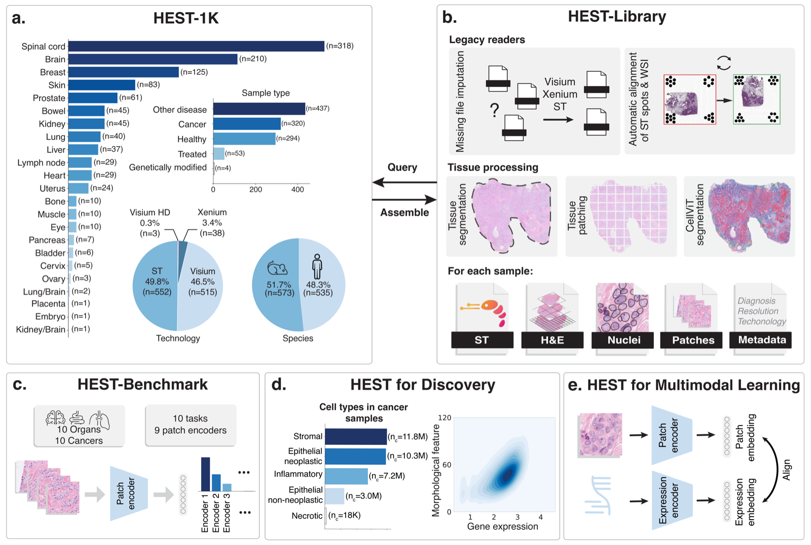
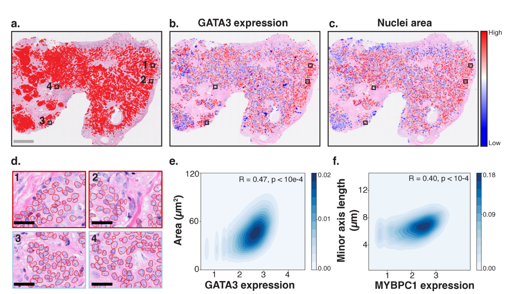

# HEST-1k: A Dataset for Spatial Transcriptomics and Histology Image Analysis

> **Bibkey** `Jaume2024_240616192` · **Venue** arXiv preprint (2024) · **Category** foundation · **Relevance** medium · **Access** open
> **Link** <https://arxiv.org/abs/2406.16192> · `status: complete`

---

## One-liner
HEST-1k is a large, multi-organ, cross-species dataset that aligns 1,229 spatial-transcriptomics (ST) profiles with paired H&E whole-slide images (WSIs) and rich metadata, shipped with the HEST-Library toolkit and HEST-Benchmark for training/evaluating pathology foundation models on morphology-to-expression prediction.

## Problem
Spatial transcriptomics reads molecular tissue composition at growing resolution, but cost, fast-evolving technology, and missing standards have confined ST computational methods to small cohorts and narrow tasks. Meanwhile the morphology encoded in H&E WSIs — strongly linked to expression — is routinely overlooked. There was no unified, standardized, large-scale paired morphology–expression resource to benchmark pathology foundation models beyond diagnosis.

## Method
(1) Unification pipeline: HEST-Library (on Scanpy/AnnData) converts heterogeneous image formats into OpenSlide-compatible pyramidal TIFF; YOLOv8 detects Visium fiducials for auto-alignment; pixel resolution is inferred from inter-spot spacing; expression matrices (CSV/MEX/TXT/h5) are unified to AnnData; a fine-tuned DeepLabV3 (ResNet50) segments tissue; 224×224 patches at 20× are cropped around each spot. (2) Benchmark protocol: from each 112×112 μm H&E patch, a frozen foundation model extracts features fed to Random Forest (70 trees) / Ridge regression predicting the top-50 highly variable genes, under patient-stratified k-fold CV, scored by Pearson correlation. (3) Multimodal alignment: CONCH's last 3 ViT layers are fine-tuned with an InfoNCE contrastive loss.

## Data
HEST-1k (latest version) contains 1,229 ST profiles, each paired with one WSI and metadata; assembled from 153 public+internal cohorts spanning 26 organs, two species (human, mouse), 367 cancer samples across 25 cancer types; yielding ~2.1M expression–morphology pairs and >76M nuclei. ST technologies include Visium/Visium HD, Xenium (subcellular), and original Spatial Transcriptomics; both frozen and FFPE tissue at 10×/20×/40×. Sources include 10x Genomics, NCBI, Mendeley, Spatial-Research, Zenodo, and internal cohorts. (Note: the fetched v1 HTML reports earlier figures — 1,108 samples / 131 cohorts / 25 organs / 320 cancer samples / 1.5M pairs / ~60M nuclei / 825 GB; the experimental details below are quoted from v1.)

## Key results
**HEST-Benchmark** (10 gene-expression prediction tasks over 9 human cancer types / 10 organs, 10 foundation models): top mean Pearson correlation is UNI 0.319, then GigaPath 0.316, CONCH 0.315, Remedis 0.315, CTransPath 0.295. Per-task range spans HCC 0.034 to SKCM (UNI) 0.613. Findings: student-teacher self-supervised pretraining beats supervised; CONCH (ViT-Base, 86M) gains ~5% absolute over second-best under Ridge and matches ViT-Giant GigaPath (1.13B) at ~13× fewer parameters. **Biomarker exploration**: on IDC Xenium, neoplastic nuclear area correlates with GATA3 at R=0.47 (FLNB R=0.49, TPD52 R=0.49, FOXA1 R=0.47); size features correlate most, shape/topology weakly (R<0.2). **Multimodal learning**: fine-tuning CONCH on 5 Xenium IDC cases (47,051 pairs, 238 genes), then predicting ER/PR/HER2 on BCNB (n=1,058 WSIs): ER AUC 0.881→0.884, PR AUC 0.810→0.818, HER2 AUC 0.715→0.724 — most metrics improve.

## Contributions
- The largest, most diverse paired ST+H&E WSI dataset to date (26 organs / 2 species / 25 cancer types) with ~2.1M morphology–expression pairs and >76M nuclei.
- HEST-Library: an open-source toolkit that unifies heterogeneous raw ST data into AnnData + pyramidal TIFF + spot-aligned patches end-to-end.
- HEST-Benchmark: the first multi-task benchmark systematically evaluating pathology foundation models on morphology-to-expression prediction.

## Limitations
- ST data is inherently noisy (staining/compression artifacts), affecting label quality.
- Batch effects across samples/datasets/technologies are not quantified.
- Some tasks have tiny cohorts (HCC 2 patients, PAAD 3), and some cancers show very low morphology–expression correlation (HCC 0.034).
- HEST-Library cannot cover all legacy formats; data is research-only (diagnostic use prohibited).

## Relation to our direction
This is a **foundational data substrate and direct raw material for the "virtual tissue" stage** of our pipeline. For virtual-tissue modelling: HEST-1k supplies spatially aligned (H&E patch ↔ gene expression) pairs — exactly the training data to model tissue as a spatial map of predictable molecular state; HEST-Benchmark's morphology-to-expression task is isomorphic to our "infer molecular state from image" goal, and its eval protocol is directly reusable. For anomaly detection: because spot-level expression ground truth exists, one can contrast morphology–expression deviations between normal and tumor regions to construct spatial "expression-anomaly" labels. For gene-revert: it provides quantitative morphology–gene links across many tissue types (e.g. nuclear area ↔ GATA3/FOXA1) as a prior and validation set for "which genes drive a morphological state," though it contains no perturbation/reversion interventions and must be paired with perturbation data (e.g. Perturb-seq). Overall it sits at the data/representation layer, not the algorithm layer.

## Reusable assets
- **Dataset:** HEST-1k on HuggingFace Datasets (`MahmoodLab/hest`); 1,229 ST+WSI profiles, download directly or filter subsets by cancer type/organ/technology.
- **Code:** HEST-Library — <https://github.com/mahmoodlab/hest> (Scanpy/AnnData-based; format unification, YOLOv8 fiducial alignment, DeepLabV3 tissue segmentation, spot-aligned 224×224 @20× patching, batch download).
- **Eval protocol:** HEST-Benchmark — 10 tasks, top-50 HVG expression prediction from 112×112 μm patches, patient-stratified k-fold CV, Pearson correlation, RF (70 trees)/Ridge readouts.
- **Foundation models scored:** UNI, CONCH, GigaPath, Phikon, PLIP, CTransPath, Remedis, Ciga, KimiaNet, ResNet50-IN — ready-made baselines and their relative strengths.
- **License:** CC BY-NC-SA 4.0 (non-commercial, research-only).

## Follow-ups
- UNI and CONCH source papers (strongest models in the benchmark).
- Later HEST-1k / arXiv versions to confirm final figures (1,229 vs 1,108) and any added tasks.
- Pair with perturbation data (Perturb-seq / drug-perturbation ST) for the gene-revert stage.
- Reproduction details of CellViT nuclear segmentation and BCNB ER/PR/HER2 downstream eval.

## Figures & tables


**Fig 1.** Overview of HEST: the HEST-1k dataset of 1,108 paired spatial-transcriptomics + H&E whole-slide images; HEST-Library functionalities; and downstream applications — foundation-model benchmarking, biomarker discovery, and multimodal representation learning.
_Source: https://arxiv.org/html/2406.16192v1/x1.png  ·  License: arXiv (open) / paper CC BY-NC-SA 4.0_


**Fig 2.** Biomarker discovery on an invasive ductal carcinoma (IDC) Xenium sample: neoplastic-nuclei overlay, GATA3 expression heatmap, nuclear-area distribution, CellViT segmentation examples, and correlations between morphological features and gene expression (e.g. nuclear area ↔ GATA3).
_Source: https://arxiv.org/html/2406.16192v1/x2.png  ·  License: arXiv (open) / paper CC BY-NC-SA 4.0_

### Results

**Table 1.** HEST-Benchmark: Pearson correlation (mean±sd, patient-stratified k-fold CV) of 10 pathology foundation models across 10 gene-expression prediction tasks. **Bold** = best per task. The Average column is the mean Pearson across tasks; UNI is highest (0.319), while CONCH leads on individual tasks (IDC / LYMPH_IDC).

| Model | IDC | PRAD | PAAD | SKCM | COAD | READ | CCRCC | HCC | LUNG | LYMPH_IDC | **Average** |
|---|---|---|---|---|---|---|---|---|---|---|---|
| ResNet50 | 0.440 | 0.318 | 0.389 | 0.446 | 0.107 | 0.051 | 0.136 | 0.034 | 0.497 | 0.205 | 0.262 |
| KimiaNet | 0.420 | 0.328 | 0.410 | 0.452 | 0.080 | 0.038 | 0.136 | 0.028 | 0.507 | 0.206 | 0.261 |
| Ciga | 0.406 | 0.332 | 0.397 | 0.484 | 0.102 | 0.046 | 0.127 | 0.045 | 0.515 | 0.218 | 0.267 |
| CTransPath | 0.454 | 0.346 | 0.406 | 0.535 | 0.123 | 0.083 | 0.171 | 0.060 | 0.531 | 0.238 | 0.295 |
| Phikon | 0.430 | 0.377 | 0.372 | 0.516 | 0.137 | 0.138 | 0.178 | 0.041 | 0.541 | 0.243 | 0.297 |
| PLIP | 0.436 | 0.362 | 0.392 | 0.461 | 0.112 | 0.063 | 0.124 | 0.038 | 0.533 | 0.229 | 0.275 |
| Remedis | 0.491 | 0.335 | 0.451 | 0.577 | 0.125 | 0.099 | 0.200 | 0.059 | 0.573 | 0.243 | 0.315 |
| GigaPath | 0.492 | 0.372 | 0.425 | 0.541 | 0.139 | 0.156 | 0.182 | 0.055 | 0.547 | 0.248 | 0.316 |
| CONCH | **0.504** | 0.373 | 0.431 | 0.582 | 0.124 | 0.132 | 0.149 | 0.040 | 0.569 | **0.249** | 0.315 |
| UNI | 0.502 | 0.357 | 0.424 | **0.613** | 0.147 | 0.162 | 0.186 | 0.051 | 0.511 | 0.234 | **0.319** |

_Source: https://arxiv.org/html/2406.16192v1 (Table 1) · Standard deviations are omitted for readability; see the original paper for the full ±sd._

## Cite
```bibtex
@misc{Jaume2024_240616192,
  title = {HEST-1k: A Dataset for Spatial Transcriptomics and Histology Image Analysis},
  author = {Guillaume Jaume and Paul Doucet and Andrew H. Song and Ming Y. Lu and Cristina Almagro-Pérez and Sophia J. Wagner and Anurag J. Vaidya and Richard J. Chen and Drew F. K. Williamson and Ahrong Kim and Faisal Mahmood},
  year = {2024},
  eprint = {2406.16192},
  archivePrefix = {arXiv},
  url = {https://arxiv.org/abs/2406.16192}
}
```


---

📄 **[AI-ready full-text extract →](ai-ready.md)**
