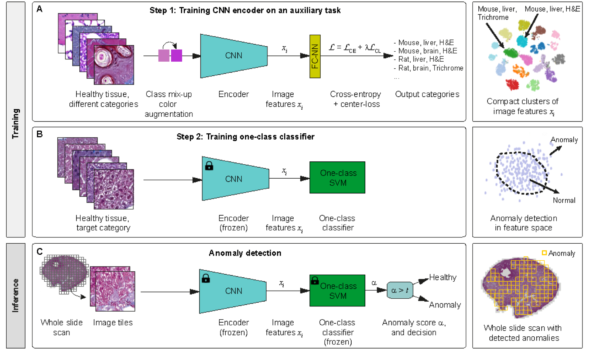
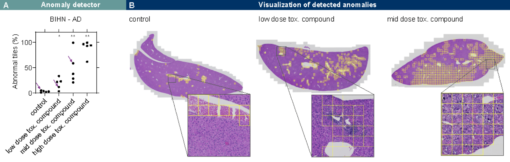

# Boehringer-Ingelheim/anomaly-detection-in-histology

> **文献键** `histo-anomaly-bi-repo` · **来源** GitHub(2022) · **类别** histopath · **相关度** medium · **获取** open
> **链接** <https://github.com/Boehringer-Ingelheim/anomaly-detection-in-histology> · `status: complete`

---

## 一句话
Boehringer Ingelheim 开源的 PyTorch 代码库,只用「健康组织」训练表征,再用 one-class 分类器在组织病理全切片上检测药物毒性引起的异常改变。

## 研究问题
在药物开发的毒性评估中,异常(病变)样本稀少且难以穷举标注,监督分类不可行。目标是仅凭大量健康组织学习一个足够判别的表征,使任何偏离「正常」的组织都能被检出——用于早期化合物毒性筛查,减少昂贵的后期失败。

## 方法
分两阶段。(1) 表征学习:在健康组织上训练 CNN(EfficientNet-B0,320px 输入),辅助任务是区分健康组织的物种/器官/染色剂——这些标签可从元数据自动获得,无需额外标注;并加 center-loss 正则,使同类表征更紧致、利于异常检测。(2) 异常检测:在训练好的 CNN 深层特征上拟合 one-class SVM,对新切片打异常分。支持 H&E 与 Masson 三色两种染色。代码入口:`train_cnn.py`、`anomaly_detector.py`、`model_use_example.py`,配置在 `configs/`。

## 数据
训练:多物种、多器官、多染色的健康组织。评测:正常小鼠肝 vs. NAFLD(非酒精性脂肪肝)病变样本——一个已公开的肝脏异常数据集。数据托管在 OSF:<https://osf.io/gqutd/>。

## 主要结果
肝脏异常检测:H&E 平衡准确率 94.20%、AU-ROC 97.33%、F1 94.09%;Masson 三色 平衡准确率 97.51%、AU-ROC 99.03%、F1 97.51%。论文称其超过常规 anomaly-detection 基线,并与专门为肝脏定量设计的方法相当。

## 创新点
- 用健康样本元数据(物种/器官/染色)自动构造辅助分类任务来学表征,零额外标注。
- center-loss 正则 + one-class SVM 的组合显著提升病理异常检出。
- 完整可复现工程:代码 + OSF 数据 + 预训练权重 + 评测脚本,MIT 许可。

## 局限
- 验证集中在肝脏(小鼠肝 / NAFLD),向其他器官与病变类型的迁移未在此库充分展示。
- 仅输出「异常 / 分数」,不定位或解释是哪些基因/通路驱动;非生成、不可逆推。
- 依赖 patch 级 CNN 表征,分辨率(320px)与染色两类,泛化到新染色/扫描仪需重训。

## 与本研究方向的关系
直接对应流水线的**第一环:anomaly detection**。这是一个「只学正常、检出偏离」范式在组织病理上的干净、经过工业验证的实现,正是我们要在图像/空间组学上检测「疾病或药物扰动导致改变的区域」的思路。可直接借鉴:(a) 用元数据自动构造辅助任务学表征的策略,可迁移到我们自己的 histopath/空间组学正常图谱;(b) center-loss + one-class 的异常打分协议可作为基线。但它止步于「打分」,不涉及 virtual tissue 建模,也不做 gene-revert 预测——后两环需要我们在其检出的异常区域之上另接空间组学/生成模型。可作为 histopath 模态异常检测的 baseline 与工程模板。

## 可复用资产
- 代码库(MIT):`train_cnn.py` / `anomaly_detector.py` / `model_use_example.py`,配置 `configs/cfg_training_cnn.py`、`configs/cfg_anomaly_detector.py`。
- 预训练产物:CNN 权重(`.pt`)、one-class SVM(`.pkl`)。
- 数据集(OSF):<https://osf.io/gqutd/>,含正常小鼠肝与 NAFLD 评测集。
- 评测协议:balanced accuracy / AU-ROC / F1,可直接复用为异常检测评测标准。

## 待读
- 精读配套论文 Zingman et al., *Medical Image Analysis* 92 (2024) 103067,arXiv:2210.07675——看 center-loss 消融与基线对比细节。
- 评估把该表征替换为病理 foundation model(如 UNI/CONCH/Virchow)后异常检测是否更强。
- 探索在检出的异常 patch 上对接空间转录组以进入 virtual-tissue / gene-revert 环节。

## 图表


**图1.** 方法总览。**A（训练步骤1)**:在健康组织(多物种/器官/染色类别)上训练 CNN 编码器完成辅助分类任务,配合 class mix-up 颜色增强,损失为交叉熵 + center-loss(𝓛=𝓛_CE+λ𝓛_CL),使同类图像特征形成紧致簇。**B(训练步骤2)**:冻结编码器,在目标类别健康组织的特征上训练 one-class SVM,在特征空间划出「正常」边界。**C(推理)**:全切片扫描切成图块 → 冻结 CNN 提特征 → 冻结 one-class SVM 输出异常分 α → 阈值判定(α>t 为异常),最终在整张 WSI 上标出检出的异常区域。
_Source: https://github.com/Boehringer-Ingelheim/anomaly-detection-in-histology/blob/master/docs/Scheme_extended.png  ·  License: MIT (repo) / arXiv:2210.07675_


**图2.** 检出异常示例。**A:** BIHN 异常检测器输出的「异常图块占比(%)」随毒性化合物剂量(对照 / 低 / 中 / 高剂量)升高而增大;顶部星号表示与对照组均值相比的统计显著性。**B:** 异常在 WSI 上的可视化——对照组(左)仅少量假阳(血液等非病理结构),低剂量与中剂量处理组(中、右)检出的异常(黄框图块)对应病理性改变,并经病理学家确认。
_Source: https://github.com/Boehringer-Ingelheim/anomaly-detection-in-histology/blob/master/docs/tox_pattern.png  ·  License: MIT (repo) / arXiv:2210.07675_

### 结果表

**表1.** BIHN 模型在 NAFLD 肝脏异常检测数据集上的预期性能(正常小鼠肝 vs. NAFLD 病变),按染色划分。

| Staining | Balanced accuracy | AU-ROC | F1 score |
|---|:---:|:---:|:---:|
| H&E | 94.20% | 97.33% | 94.09% |
| Masson's Trichrome | 97.51% | 99.03% | 97.51% |

_Source: repo README (https://github.com/Boehringer-Ingelheim/anomaly-detection-in-histology)  ·  License: MIT_

## 引用
```bibtex
% no BibTeX fetched
```


---

📄 **[AI-ready 全文提取 →](ai-ready.md)**
