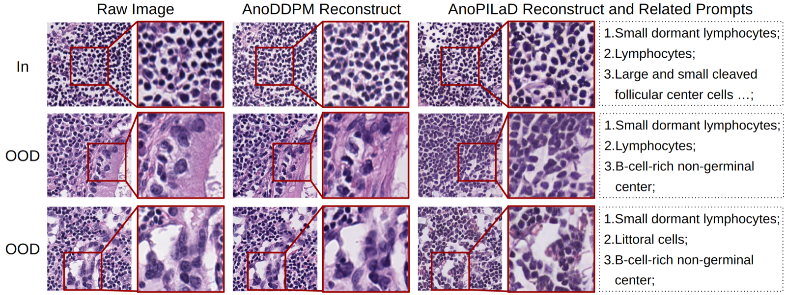
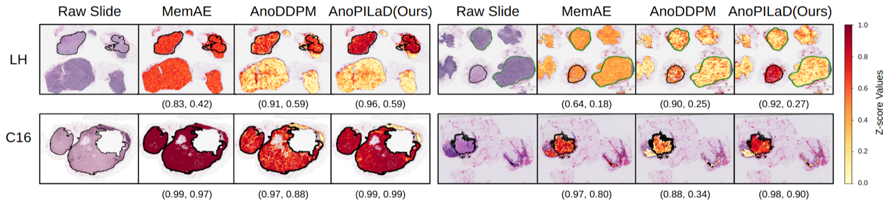

# Pathology-Informed Latent Diffusion Model for Anomaly Detection in Lymph Node Metastasis

> **Bibkey** `histo-miccai-2025` · **Venue** MICCAI 2025 (2025) · **Category** histopath · **Relevance** medium · **Access** open
> **Link** <https://papers.miccai.org/miccai-2025/0675-Paper2270.html> · `status: complete`

---

## One-liner
AnoPILaD is a pathology-informed latent diffusion model: a VLM (CONCH) selects normal-tissue keywords that condition an LDM's reconstruction toward normal morphology, and the input-vs-reconstruction discrepancy serves as an unsupervised anomaly score for lymph-node metastasis.

## Problem
Supervised metastasis detection needs exhaustive annotation, which is scarce in digital pathology. Unsupervised reconstruction-based methods (e.g. AnoDDPM) train only on normal tissue but reconstruct poorly, yielding many false positives and weak normal/abnormal separation. The paper aims to sharpen this separation and improve cross-organ robustness.

## Method
AnoPILaD fine-tunes a Stable Diffusion v1.5 LDM with LoRA (rank 4, lr 1e-5, batch 64) on normal patches only, with a text-conditioned denoising loss. A "weighted prompt" module takes 74 pathologist-validated normal-lymph-node keywords, uses CONCH (VLM pretrained on 1.17M pathology image-caption pairs) to pick the top-5 by cosine similarity, normalizes scores by their median for weighting, and encodes them via Compel into the LDM condition. Following AnoDDPM, an input is partially noised to timestep t (674 here) and reverse-denoised under the prompt to a "normal-like" reconstruction; input-vs-reconstruction discrepancy is the anomaly score. Inference uses a PLMS sampler with 100 steps.

## Data
Two lymph-node WSI datasets at 20× (256×256 patches). LH (local hospital gastric): 808 WSIs (751 normal / 57 metastasis); train 643 normal WSIs = 1.37M patches, val 50, in-dist test 58, OOD test 57. C16 (Camelyon16 breast, public) for domain-shift testing: 32 val / 80 in-dist / 49 metastasis WSIs (22 with tumor clusters >2mm = "C16 Macro"); 55,659 OOD patches.

## Key results
Patch-level (Table 2): AnoPILaD LH AUC 0.9587 / AUPR 0.9499; C16 AUC 0.8884 / AUPR 0.6987, ~0.22 AUC above AE/MemAE under domain shift. WSI-level (Table 3): LH classification AUC up to 0.9943 (Z99); C16 Macro AUC ~0.806 vs ~0.5-0.6 for others. Segmentation: AnoPILaD best DICE/IoU/TNR everywhere (C16 Macro DICE 0.5420 vs AnoDDPM 0.3131); AE/MemAE classify okay but localize poorly (near-uniform heatmaps).

## Contributions
- Couples a pathology VLM (CONCH) with an LDM, using normal-tissue keyword prompts as an inductive bias for reconstruction-based anomaly detection.
- A weighted-prompt module: 74 validated keywords, CONCH top-5 selection, median-normalized weights, Compel encoding.
- Demonstrates cross-organ (gastric→breast) robustness and argues segmentation/localization, not just classification, is the meaningful anomaly-detection metric.

## Limitations
- Large cross-domain drop remains (C16 WSI AUC ~0.67 vs LH ~0.99); absolute segmentation DICE still modest (0.54 on C16 Macro).
- Keyword pool is hand-curated and lymph-node-specific; no ablation on prompt count/source; new organs need a new vocabulary.
- Only two organs / partly-private data; reconstruction timestep t=674 tuned on LH may not transfer.

## Relation to our direction
Squarely at stage 1 (anomaly detection) of our pipeline, and a near-ideal template: model only normal tissue generatively, treat disease/metastasis as OOD, and both detect and localize it via z-score heatmaps + segmentation. Its "reconstruct-to-normal, discrepancy = anomaly" scheme is an image-domain prototype of a virtual (normal) tissue that reverts an abnormal sample to normal morphology, structurally analogous to our "revert the anomaly" goal but in pixels rather than genes. Reusable ideas: (1) conditioning a generative normal-tissue model on foundation-model priors/text; (2) the CONCH weighted-keyword prompting could map onto spatial-omics by conditioning on marker/pathway vocabularies. It does not do gene-level revert prediction (stage 3) but offers a concrete localization/eval protocol.

## Reusable assets

- Code: <https://github.com/QuIIL/AnoPILaD> (MIT). Scripts for CONCH captioning, LoRA fine-tuning of SD v1.5, and reconstruction/anomaly scoring; deps: diffusers, CONCH, compel, CFG++ solver, python 3.11. No released checkpoints. C16 (Camelyon16) is public for reproducing the cross-domain test; LH data is private. Reusable eval protocol: patch AUC/AUPR from z-scores; WSI Zmax & Z99 scoring with 2×2 erosion; DICE/IoU + TNR for localization at threshold 0; FID for checkpoint selection. Plus the 74-keyword normal-lymph-node vocabulary and weighted-prompt recipe.

## Follow-ups
- AnoDDPM (Wyatt 2022) and Linmans 2024 (Med Image Anal 93:103088), the direct baselines.
- CONCH (Lu 2023, arXiv:2307.12914) as a pathology VLM to probe for omics conditioning.
- Compel weighted-embedding internals; whether keyword weights can be swapped for gene/marker expression weights.

## Figures & tables


**Fig 2.** (Top) Weighted-prompt generation: CONCH text/image encoders score 74 normal keywords against the input by cosine similarity, take the top-5, median-normalize into weights, and Compel builds a weighted prompt (e.g. "small dormant lymphocytes: 1.06 … littoral cells: 0.83") fed to the LDM. (Bottom) Distribution of the top-10 frequent keywords in train vs test (in-distribution vs OOD).
_Source: https://papers.miccai.org/miccai-2025/paper/2270_paper.pdf (Fig. 2)  ·  License: MICCAI 2025 Open Access_


**Fig 1.** Diffusion reconstructions. For in-distribution (row 1) and OOD (rows 2-3) inputs, AnoDDPM and AnoPILaD both reconstruct "normal-like" tissue; with text prompts AnoPILaD yields more uniform lymphocytic arrangements and suppresses pleomorphic/fibrotic structure. Right column lists the selected keyword prompts.
_Source: https://github.com/QuIIL/AnoPILaD (main.png; MIT) = paper Fig. 1_


**Fig 3.** Z-score anomaly heatmaps for four metastasis slides (two each from LH and C16). Black contours = metastasis annotation, green = normal annotation; parentheses give per-slide (Z99, DICE). AnoPILaD localizes tumor more precisely with fewer false positives on normal tissue.
_Source: https://papers.miccai.org/miccai-2025/paper/2270_paper.pdf (Fig. 3)  ·  License: MICCAI 2025 Open Access_

### Results

**Table 2.** Patch-level anomaly detection, AUC / AUPR (LH = gastric nodes; C16 = Camelyon16 breast, cross-organ domain shift). Bold = best.

| Method | LH AUC | LH AUPR | C16 AUC | C16 AUPR |
|---|---|---|---|---|
| NLL | 0.4982 | 0.5552 | 0.3250 | 0.1600 |
| Regret | 0.6720 | 0.6718 | 0.6480 | 0.3441 |
| LLR | 0.6078 | 0.6260 | 0.7065 | 0.4765 |
| complexity | 0.7931 | 0.7139 | 0.7752 | 0.5140 |
| f-AnoGAN | 0.2289 | 0.3377 | 0.1735 | 0.1104 |
| AE | 0.9254 | 0.8906 | 0.6584 | 0.4759 |
| MemAE | 0.9290 | 0.8886 | 0.6611 | 0.4880 |
| AnoDDPM | 0.8555 | 0.7841 | 0.6857 | 0.5741 |
| **AnoPILaD** | **0.9587** | **0.9499** | **0.8884** | **0.6987** |

**Table 3.** WSI-level classification, each cell AUC / AUPR; two scores: Zmax (max z-score) and Z99 (99th-percentile). C16 Macro = subset with tumor clusters >2mm. Bold = best.

| Method | LH Zmax | LH Z99 | C16 Zmax | C16 Z99 | C16-Macro Zmax | C16-Macro Z99 |
|---|---|---|---|---|---|---|
| AE | 0.9622 / 0.9612 | 0.9395 / 0.9381 | 0.6612 / 0.5961 | 0.5798 / 0.5217 | 0.6398 / 0.3677 | 0.5523 / 0.2918 |
| MemAE | 0.9504 / 0.9440 | 0.9365 / 0.9382 | 0.6505 / 0.5689 | 0.5686 / 0.5313 | 0.6381 / 0.3657 | 0.5597 / 0.3141 |
| AnoDDPM | 0.7840 / 0.6616 | 0.9383 / 0.8995 | 0.4992 / 0.3885 | 0.4551 / 0.3905 | 0.4926 / 0.2146 | 0.5119 / 0.2347 |
| **AnoPILaD** | **0.9837 / 0.9740** | **0.9943 / 0.9948** | **0.6745 / 0.6140** | **0.6367 / 0.5902** | **0.8062 / 0.5965** | **0.8023 / 0.5886** |

_Tables 2-3 source: https://papers.miccai.org/miccai-2025/paper/2270_paper.pdf (Tables 2-3)  ·  MICCAI 2025 Open Access_

## Cite
```bibtex
% no BibTeX fetched
```


---

📄 **[AI-ready full-text extract →](ai-ready.md)**
