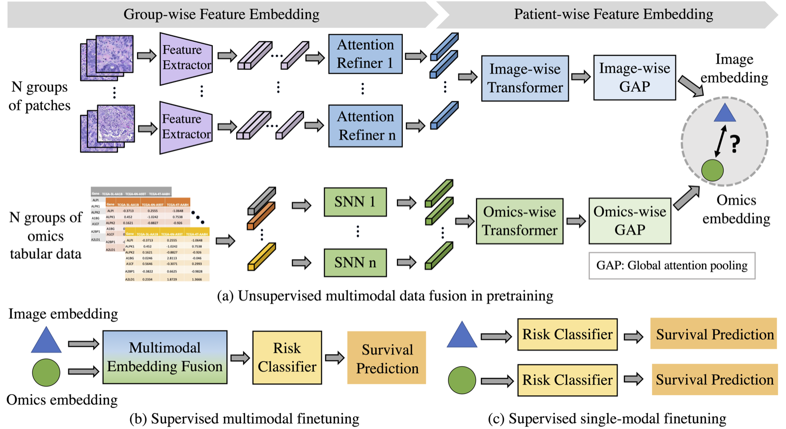

# Cassie07/PathOmics

> **Bibkey** `pathomics-repo` · **Venue** GitHub (2023) · **Category** pathology · **Relevance** medium · **Access** open
> **Link** <https://github.com/Cassie07/PathOmics> · `status: complete`

---

## One-liner
PathOmics is the official code for a MICCAI 2023 Oral paper: a pathology-and-genomics multimodal Transformer that learns fused embeddings via unsupervised multimodal pretraining, then supervised-finetunes to predict cancer survival outcomes.

## Problem
Cancer prognosis benefits from both tissue morphology (WSIs) and molecular signals (genomics), but the modalities differ in scale/dimensionality and one is often missing in practice. The problem: fuse pathology and genomics during pretraining so that downstream finetuning works with multimodal data yet remains usable when only a single modality (e.g., image-only at inference) is available, improving survival prediction.

## Method
Two-stage pipeline. (a) Unsupervised multimodal pretraining: tile WSIs into foreground patches → extract patch features with an ImageNet-pretrained ResNet50/101 saved as one .npz per slide; take corresponding genomics (miRNA) features; a multimodal Transformer fuses both to produce aligned image/genomics embeddings (pretrain loss = MSE, optional global-average-pooling via `--use_GAP_in_pretrain_flag`). (b)(c) Supervised finetuning: reuse the pretrained multimodal backbone to finetune for survival prediction on multi- or single-modal data (default fusion = `concat`). Supports data-efficient finetuning (`--less_data`, `--finetune_test_ratio`) and cross-dataset transfer (pretrain on COAD → finetune on READ).

## Data
TCGA-COAD (colon adenocarcinoma) and TCGA-READ (rectal adenocarcinoma). Imaging modality is WSIs (user downloads from TCGA, tiles, extracts features); genomics is miRNA from cBioPortal (`coadread_tcga_pan_can_atlas_2018`). COAD uses 4-fold CV + hold-out; COAD→READ transfer uses 5-fold. The repo ships no raw data or patch features — these must be generated via the preprocessing steps.

## Key results
The README lists no explicit C-index numbers (see paper https://rdcu.be/dnwKf). Confirmable qualitatively: the method was a MICCAI 2023 Oral (top 9%); its selling point is that the multimodal pretrained backbone yields usable survival-prediction performance even with single-modal input downstream, plus cross-cancer transfer (COAD→READ) and data-efficient finetuning. (Exact metrics live in the paper, not the repo.)

## Contributions
- Unsupervised multimodal pretraining that aligns pathology and genomics embeddings into a transferable fused backbone.
- Modality-flexible finetuning: works with multi- or single-modal input, mitigating missing-modality settings.
- Cross-dataset transfer (COAD→READ) and data-efficient finetuning options; ships a continually-updated table of 45+ pathology-genomics multimodal methods.

## Limitations
- Validated only on colorectal (COAD/READ) + miRNA; generalization to other cancers/omics not shown in-repo.
- Feature extraction relies on legacy ImageNet-ResNet rather than pathology foundation models (UNI/CONCH), capping representation quality.
- Task is survival prediction, not anomaly detection/spatial localization; README has no numeric results and no released checkpoint, so reproduction requires downloading TCGA and running full preprocessing.

## Relation to our direction
It sits at the "virtual tissue / multimodal representation modelling" stage, not the anomaly-detection or gene-revert stages. Its value is a complete engineering recipe for pairing and fusing pathology-image with genomics: aligning WSI patch features and molecular features inside one Transformer to yield transferable embeddings. For our virtual-tissue modelling, the multimodal-pretraining + modality-flexible-finetuning idea transfers directly — the "infer even when a modality is missing" property fits real spatial-omics where paired expression is often absent. However, it does no perturbation/anomaly modelling and does not predict which gene, if modulated, reverts an anomaly; connecting it to the gene-revert stage would require reworking its fused representation into a perturbation-sensitive, counterfactually-generative model. Reusable as a baseline / representation-alignment component, not a ready-made revert engine.

## Reusable assets

## Follow-ups
- Read the paper for exact C-index and ablations (single- vs multimodal, GAP, fusion type).
- Compare with SurvPath / TANGLE (CVPR 2024) and assess replacing ResNet features with pathology foundation models (UNI/CONCH).
- Evaluate wiring its fused embeddings into our anomaly-detection / counterfactual gene-revert pipeline.

## Figures & tables


**Fig 1.** Overview of the two-stage PathOmics pipeline. (a) Unsupervised multimodal pretraining: WSIs are tiled into N groups of patches → Feature Extractor → Attention Refiner + Image-wise Transformer + GAP yields the image embedding (blue triangle); grouped omics tabular data pass through SNN + Omics-wise Transformer + GAP to yield the omics embedding (green circle); the two are aligned/fused during pretraining (GAP = Global attention pooling). (b) Supervised multimodal finetuning: fused image+omics embeddings → Multimodal Embedding Fusion → Risk Classifier → survival prediction. (c) Supervised single-modal finetuning: image-only or omics-only embedding → Risk Classifier → survival prediction, enabling missing-modality inference.
_Source: https://github.com/Cassie07/PathOmics/raw/main/Figures/Figure1.png  ·  License: GitHub README figure (MICCAI 2023, Ding et al.)_

### Results

**Table 1.** The README contains no numeric results table (no C-index / AUC figures). The actual survival-prediction metrics (TCGA-COAD 4-fold CV + hold-out, COAD→READ transfer, single- vs multimodal, data-efficient ablations) live in the MICCAI 2023 paper, not in this repo — numbers are not invented here.

_C-index results: see the paper → https://rdcu.be/dnwKf (Ding et al., MICCAI 2023, pp. 622–631)._

## Cite
```bibtex
@inproceedings{ding2023pathology,
  title={Pathology-and-genomics multimodal transformer for survival outcome prediction},
  author={Ding, Kexin and Zhou, Mu and Metaxas, Dimitris N and Zhang, Shaoting},
  booktitle={International Conference on Medical Image Computing and Computer-Assisted Intervention},
  pages={622--631},
  year={2023},
  organization={Springer}
}
```


---

📄 **[AI-ready full-text extract →](ai-ready.md)**
