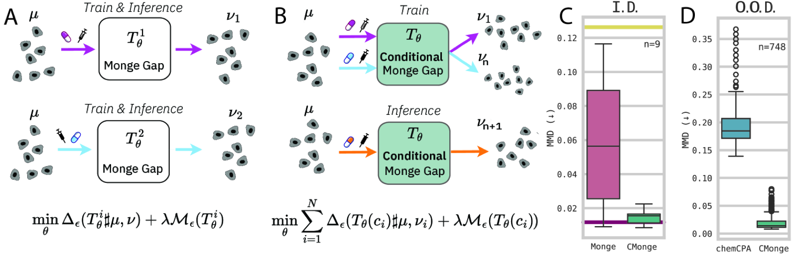
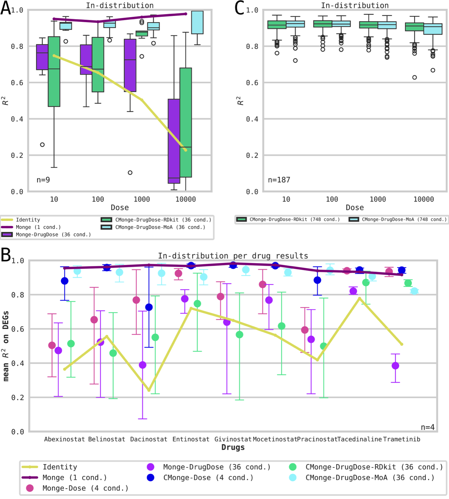
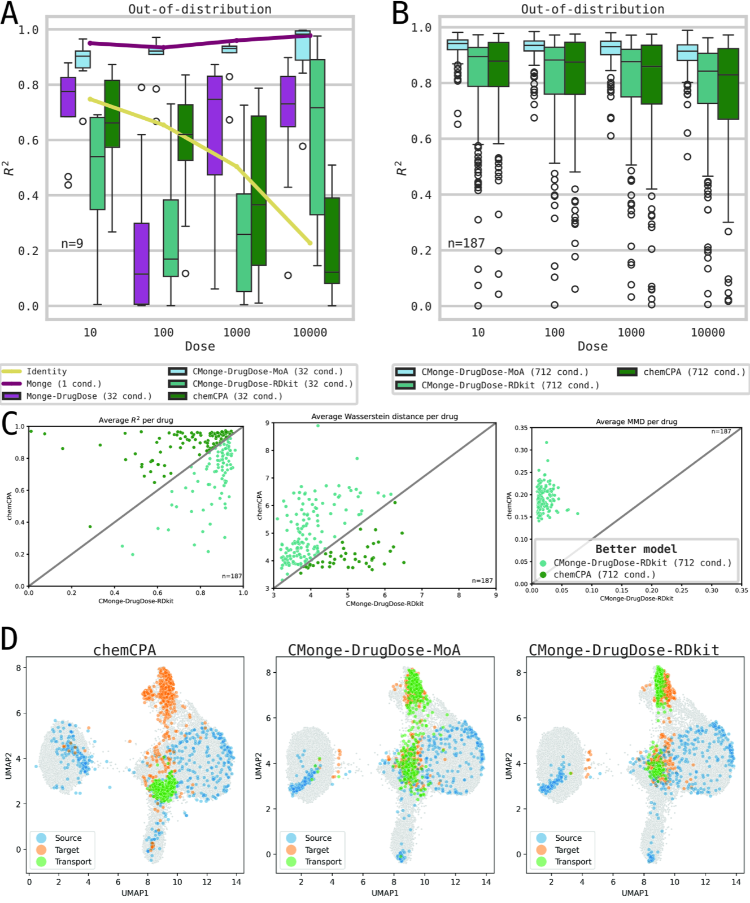

# Conditional Monge Gap enables generalizable single-cell perturbation modelling

> **Bibkey** `Driessen_2026` · **Venue** Nature Machine Intelligence (2026) · **Category** single-cell · **Relevance** medium · **Access** paywall
> **Link** <https://doi.org/10.1038/s42256-026-01242-8> · `status: complete`

---

## One-liner
CMonge is a conditional neural optimal-transport method that learns a single map from control to perturbed single-cell distributions conditioned on arbitrary covariates (drug, dose, cell type, combinations), and generalizes to unseen drugs from compound structure alone.

## Problem
Single-cell perturbation data are unpaired (cells are destroyed on measurement), forcing distribution-level modelling. Prior neural OT (e.g. CellOT) trains one model per condition, cannot condition on treatment context, and fails to generalize to unseen drugs/doses. The goal: one parameter-efficient model that both conditions on covariates and generalizes to unseen perturbations.

## Method
Builds on the Monge Gap (an ICNN-free OT-map regularizer). An encoder–decoder maps control-cell representations to perturbed ones, injecting a condition vector (drug/dose/combination embedding). Objective = Sinkhorn-divergence fitting term + Monge-gap regularizer. Two drug-embedding families are compared: RDKit fingerprints (194-d, structure-based, from SMILES) and Mode-of-Action embeddings (10-d, effect-based, MDS over pairwise Wasserstein distances between treated populations). Aggregating hundreds of conditions enables cross-task learning and OOD prediction. An autoencoder is trained first for dimensionality reduction, then the conditional Monge model in latent space.

## Data
(1) **SciPlex3** scRNA-seq: 762,039 cells, three cancer lines (A549/K562/MCF7), 187–188 compounds × 4 doses + control, 748 drug-dose conditions. (2) **4i** multiplexed protein imaging: 97,748 cells (10,995 controls), melanoma lines, 35 therapies (~2,500 cells each), 48 marker/morphology features, including combination therapies.

## Key results
In-distribution (SciPlex, 9 drugs): unconditional Monge upper bound R²≈0.950–0.978; CMonge-Dose-ID R²=0.882–0.974 with 4× fewer models; DrugDose-MoA-ID on par with 36 per-condition models. OOD unseen drugs: CMonge-MoA-OOD R²≈0.90 vs chemCPA ≈0.76 at highest dose; at 712 conditions 0.900±0.059 vs 0.760±0.211. On 4i, CMonge-MoA beats identity on MMD for combination therapies. Parameter-efficient vs single-cell foundation models; predicts unseen drugs from structure alone.

## Contributions
- Conditionalizes the Monge Gap into a **Conditional Monge Gap** that shares a single OT map across arbitrary covariates (drug/dose/cell type/combination) — the first neural OT perturbation model to unify conditioning with parameter efficiency.
- Cross-task training over hundreds of conditions achieves **OOD generalization to unseen drugs/doses**, needing only compound structure (SMILES→RDKit) or MoA embeddings.
- Systematically compares structure-based (RDKit) and effect-based (MoA) drug embeddings, validating on both scRNA-seq and protein-imaging modalities.
- Merged upstream into `ott-jax` (OTT library PR #605), making the method reusable.

## Limitations
- RDKit fingerprints need substantially more training conditions to match MoA; with few conditions the structural representation introduces noise.
- The highest-dose conditions are the hardest to learn (strongest perturbation).
- MoA embeddings depend on measured single-drug populations; combination treatments lacking single-drug measurements cannot be evaluated.
- A few drugs with markedly different mechanisms (e.g. trametinib) are predicted noticeably worse.
- On 4i data the identity baseline already has R² >0.6 (small effect size), limiting the gain from conditioning; DrugDose-MoA-ID trails the 36 per-condition models on feature-mean R² (though it is better on Wasserstein).

## Relation to our direction
Sits in the virtual-tissue / perturbation-response → gene-and-drug-revert stage, not anomaly detection. CMonge models control→perturbed as a conditional OT map; for our goal of predicting interventions that revert an anomalous state, its conditioning lets us search which drug/dose maps a population toward a target (normal) distribution — an in-silico intervention/repurposing screen. Its OOD generalization (unseen drugs from SMILES) fits the propose-candidate → wet-lab-validate loop. It explicitly models distribution shift, aligning with treating disease/drug-induced tissue change as an anomaly, and the Monge/Sinkhorn displacement can serve as a revert-distance metric. Caveats: population-distribution level, no spatial coordinates, and not itself an anomaly detector.

## Reusable assets
- **Code:** `AI4SCR/conditional-monge-gap` (MIT license, `pip install cmonge`; Python 3.10/3.11, JAX/OTT backend). <https://github.com/AI4SCR/conditional-monge-gap>
- **CAR-T extension:** `AI4SCR/car-conditional-monge` (extends CMonge to CAR-T scRNA-seq, with CAR-specific dataloader/embedding/trainer). <https://github.com/AI4SCR/car-conditional-monge>
- **Upstream integration:** OTT (`ott-jax`) PR #605 — conditional Monge gap merged into OTT.
- **Data:** preprocessed SciPlex3 and 4i data (ETH research collection). <https://www.research-collection.ethz.ch/handle/20.500.11850/609681>
- **Pretrained models:** the repo `models/` directory contains checkpoints (older versions need the `cmonge_checkpoint_loading` git tag).
- **Evaluation protocol:** R² (feature mean), MMD, (entropic) Wasserstein / Sinkhorn divergence; baselines such as identity, per-condition Monge, CellOT (ICNN), and chemCPA are directly reusable.
- **Preprint:** arXiv:2504.08328 (full text, with all metrics/figures).

## Follow-ups
- Close-read the arXiv:2504.08328 methods section: the exact form of the Monge-gap regularizer, autoencoder latent-space dimensionality, and where the condition is injected.
- The chemCPA paper (comparison baseline, SOTA conditional perturbation model).
- The CellOT / Monge Gap (Uscidda & Cuturi) original methods, to understand the convergence of ICNN-free OT.
- Reproduce the SciPlex3 OOD setup, set "revert to the control distribution" as the target direction, and run one in-silico intervention screen.
- Evaluate whether CMonge can transfer to spatial transcriptomics (adding spatial-coordinate / neighborhood conditions).

## Figures & tables

> The version of record is paywalled (Nature Machine Intelligence). All figures/tables below are taken from the **open preprint** arXiv:2504.08328; nothing is from the Nature page.


**Fig 1.** Method overview. A) Prior methods (Monge Gap) learn a separate local map T_θ^i per perturbation; B) CMonge uses a single model T_θ(c_i) conditioned on covariate c_i (drug/dose), trained with a Sinkhorn fitting term Δ_ε plus λ·Monge-gap regularizer M_ε, and infers on unseen conditions ν_{n+1}; C) SciPlex in-distribution (n=9 drugs): CMonge's MMD approaches per-condition Monge (yellow line = identity upper bound, purple = lower bound); D) out-of-distribution (n=748): CMonge's MMD is far below chemCPA.
_Source: https://arxiv.org/html/2504.08328v1/x1.png (Fig 1) · License: arXiv preprint (arXiv:2504.08328)_


**Fig 3.** In-distribution comparison of conditional vs unconditional Monge methods by R², across drug encodings (RDKit vs MoA) and training scales. A single conditioned CMonge model approaches per-condition models; MoA embeddings scale robustly.
_Source: https://arxiv.org/html/2504.08328v1/x3.png (Fig 3) · License: arXiv preprint (arXiv:2504.08328)_


**Fig 5.** Out-of-distribution results on SciPlex for unseen dose and drug-dose contexts: across R², Wasserstein and MMD, CMonge variants (especially with MoA embeddings) clearly outperform the SOTA conditional baseline chemCPA.
_Source: https://arxiv.org/html/2504.08328v1/x5.png (Fig 5) · License: arXiv preprint (arXiv:2504.08328)_

### Results

**Table 1.** SciPlex dose experiments, R² (feature mean, higher is better) by test dose; standard deviation in parentheses. Per-condition Monge (1 condition) is the upper bound; CMonge-Dose approaches it with 4×/3× fewer models.

| Model | Cond. seen | 10 nM | 100 nM | 1000 nM | 10000 nM |
|---|---|---|---|---|---|
| Identity | — | 0.748 (±0.127) | 0.655 (±0.261) | 0.504 (±0.332) | 0.227 (±0.212) |
| Monge (per-condition) | 1 | **0.950 (±0.020)** | **0.935 (±0.042)** | **0.960 (±0.025)** | **0.978 (±0.029)** |
| Monge-Dose-ID | 4 | 0.750 (±0.254) | 0.767 (±0.231) | 0.885 (±0.099) | 0.694 (±0.272) |
| CMonge-Dose-ID | 4 | 0.882 (±0.185) | 0.905 (±0.124) | 0.905 (±0.093) | 0.974 (±0.026) |
| Monge-Dose-OOD | 3 | 0.614 (±0.349) | 0.726 (±0.219) | 0.856 (±0.112) | 0.322 (±0.348) |
| CMonge-Dose-OOD | 3 | 0.864 (±0.197) | 0.931 (±0.058) | 0.878 (±0.118) | 0.527 (±0.311) |

**Table 2.** SciPlex full DrugDose OOD (highest dose 10000 nM, 712 training conditions). CMonge-MoA beats chemCPA on R², Wasserstein and MMD. ↑ higher is better, ↓ lower is better.

| Model | Cond. seen | R² ↑ | Wasserstein ↓ | MMD ↓ |
|---|---|---|---|---|
| CMonge-DrugDose-MoA-OOD | 712 | **0.900 (±0.059)** | **3.873 (±0.643)** | **0.013 (±0.005)** |
| CMonge-DrugDose-RDKit-OOD | 712 | 0.781 (±0.187) | 4.232 (±0.896) | 0.020 (±0.012) |
| chemCPA-DrugDoseCellLine-OOD | 712 | 0.760 (±0.211) | 4.767 (±0.976) | 0.195 (±0.035) |

_Source: tables from arXiv:2504.08328v1 (https://arxiv.org/html/2504.08328) · License: arXiv preprint_

## Cite
```bibtex
@article{Driessen_2026, title={Conditional Monge Gap enables generalizable single-cell perturbation modelling}, volume={8}, ISSN={2522-5839}, url={http://dx.doi.org/10.1038/s42256-026-01242-8}, DOI={10.1038/s42256-026-01242-8}, number={6}, journal={Nature Machine Intelligence}, publisher={Springer Science and Business Media LLC}, author={Driessen, Alice and Rajwade, Dhruva Abhijit and Harsanyi, Benedek and Rapsomaniki, Marianna and Born, Jannis}, year={2026}, month=June, pages={984–996} }
```


---

📄 **[AI-ready full-text extract →](ai-ready.md)**
