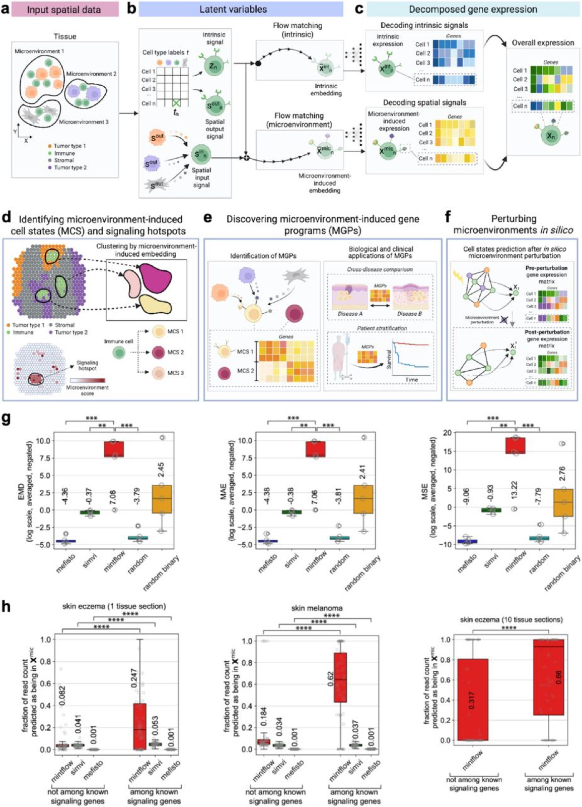
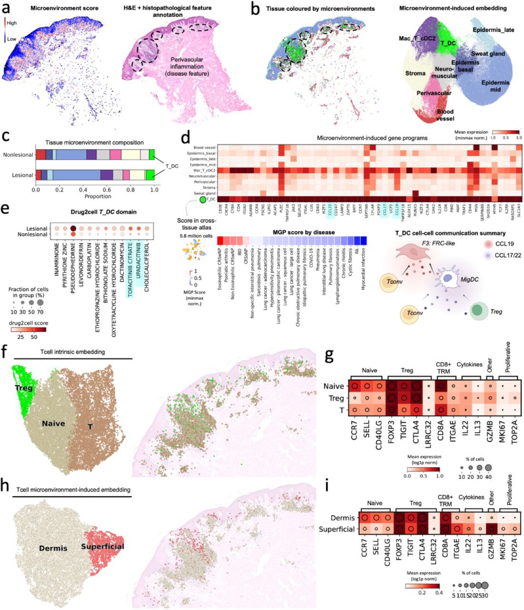
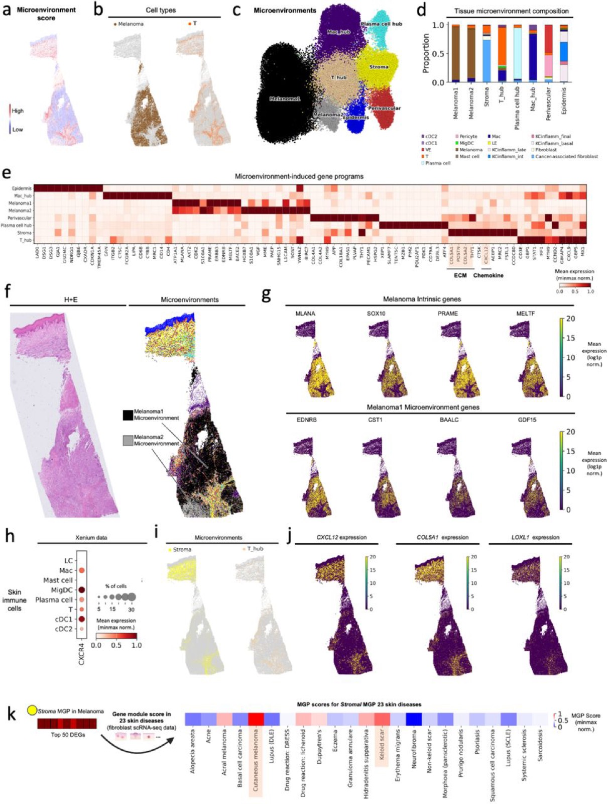

# Mapping and reprogramming human tissue microenvironments with MintFlow

> **Bibkey** `Akbarnejad_2025` · **Venue** None (2025) · **Category** spatial · **Relevance** high · **Access** open
> **Link** <https://doi.org/10.1101/2025.06.24.661094> · `status: complete`

---

## One-liner
MintFlow is a flow-matching generative model that disentangles each cell's spatial-transcriptomics expression into intrinsic vs microenvironment-induced components, and supports in silico tissue perturbation (deleting/replacing cell types) to predict the resulting gene-expression changes.

## Problem
Current spatial methods are descriptive: they cannot separate cell-intrinsic identity from microenvironment-induced state changes, lack mechanistic interpretability, rely on linear assumptions or prior ligand-receptor knowledge, scale poorly, and cannot run in silico perturbations. MintFlow aims to learn how the microenvironment reprograms cell states — without priors, predefined domains, or ligand-receptor pairs — and to simulate interventions that could revert a disease state.

## Method
A kNN graph (k=5) defines each cell's microenvironment and its microenvironment cell type composition (MCC). Per cell it infers intrinsic z_n (prior conditioned on cell type CT), outgoing s_out (conditioned on CT), and incoming s_in (neighborhood-averaged s_out, indirectly conditioned on MCC). Flow matching in latent space with a neural-ODE decoder yields intrinsic and microenvironment-induced embeddings decoded to X_int and X_mic with X = X_int + X_mic (an interpretable, built-in decomposition). Identifiability follows iVAE-style conditioning on CT/MCC (making [z, s_in] identifiable up to permutation); an optimal-transport constraint (Proposition 1) makes the X_int/X_mic split unique; Wasserstein discriminators enforce that intrinsic embeddings cannot predict neighbor cell types. Inductive graph learning (subgraph sampling via PyG neighbor loader) gives scalability to millions of cells. Downstream: cluster microenvironment-induced embeddings for microenvironment-induced cell states (MCS), a microenvironment score for signaling hotspots, MGP extraction, and in silico perturbation.

## Data
Three human diseases plus validation cohorts. (1) Atopic dermatitis: 10 skin sections / 8 individuals, Xenium 5k (8 newly generated), lesional + non-lesional, 197,487 cells after QC; validated in scRNA-seq (4 patients), a 23-disease / 6-tissue atlas, and 10 dupilumab-treated patients. (2) Cutaneous melanoma: public 5000-plex Xenium, 98,749 cells; scored across fibroblasts from 23 skin diseases. (3) ccRCC: one patient, 3 tumor cores + tumor-normal interface, 5000-plex Xenium, 337,116 cells / 24 cell types; plus ccRCC scRNA-seq (147,917 cells / 10 patients), a Kaede-mouse anti-PD-L1 model, and TCGA 606 ccRCC bulk RNA-seq. Simulated data with ground-truth microenvironment effects were used for benchmarking.

## Key results
Benchmark: significantly beats alternatives and random baselines on simulated data (MAE/EMD/MSE), assigns more known-signaling-gene counts to the microenvironment component on real data, and is the only method scalable to all 10 skin sections. Biology: (1) atopic dermatitis — a novel spatially-imprinted type 2 epidermal T_RM (CD8A+ ITGAE+ GZMB+, high IL13/IL22) and a T_DC activation hub (CCL19/CCR7, CCL22/CCL17-CCR4); in silico Treg depletion amplifies inflammation and augmentation suppresses it, matching 10 dupilumab-treated patients (responders' Tregs rise). (2) Melanoma — an inducible keloid-like stroma (CXCL12-CXCR4 + collagen cross-linking via LOX/LOXL1/LOXL2) excluding T cells. (3) ccRCC — three TLS-localized microenvironment-induced T cell states (TLS Core1/2/Border) invisible to conventional clustering; the Border exhausted state predicts worse survival (TCGA p=0.0073); TREM2+CCR1+ TLS macrophages drive suppression; in silico macrophage deletion de-exhausts T cells and the reprogrammed program flips to a survival benefit (p=0.0034); a virtual-replacement validity check upregulated 11/12 ground-truth macrophage ICB genes.

## Contributions
- First generative model to identifiably split spatial expression into interpretable intrinsic (X_int) and microenvironment-induced (X_mic) count matrices without priors, predefined domains, or ligand-receptor pairs.
- Introduces in silico tissue perturbation: delete/replace any cell type and predict neighbors' gene-expression response, enabling large-scale hypothesis generation.
- Theoretical guarantees: identifiability via iVAE-style conditioning plus an optimal-transport uniqueness proof (Proposition 1).
- Scales spatial-graph training to millions of cells via inductive graph learning.
- Links predicted reprogramming to clinical outcome (TCGA survival), closing the loop from mechanism to patient stratification.

## Limitations
- Sensitive to low read counts; requires consistent gene panels across sections.
- Flow-matching training is compute-heavy; despite neighbor sampling, it needs dataset-specific hyperparameter tuning and is hard to train.
- Susceptible to cell-segmentation errors.
- Currently limited to multiple sections (no multi-tissue atlas / transfer learning yet); in silico perturbations are model predictions needing wet-lab validation.

## Relation to our direction
Strong fit, touching all three stages, especially virtual tissue and gene-revert. (1) Virtual tissue: MintFlow already builds a perturbable generative virtual tissue, and its X = X_int + X_mic split is exactly the intrinsic-vs-microenvironment-induced (i.e. disease/perturbation-driven) separation we want. (2) Gene-revert: its in silico perturbations (delete TLS macrophages -> de-exhaust T cells; augment Tregs -> suppress inflammation) directly demonstrate predicting which cells/genes to modulate to revert an abnormal state, with TCGA survival tying the reverted program to benefit — the same paradigm we need, and a reusable perturbation-plus-evaluation protocol. (3) Anomaly detection: more indirect, but the microenvironment score (signaling hotspots) and microenvironment-induced MCS offer an unsupervised way to localize microenvironmental anomalies/lesion hotspots that could feed our revert step. Reusable: the disentanglement framework, the in silico perturbation API, and the perturbation-effect -> survival validation loop.

## Reusable assets
Package <https://github.com/Lotfollahi-lab/mintflow> (in silico perturbation API); reproducibility + simulated ground-truth data <https://github.com/Lotfollahi-lab/mintflow-reproducibility>; docs/tutorials <https://mintflow.readthedocs.io/>. Eval protocols: ground-truth simulation benchmark (MAE/EMD/MSE), signaling-gene count-attribution test, perturbation sensitivity analysis, an in-silico-perturbation validity check (virtual replacement -> 11/12 macrophage ICB genes), and perturbation-program -> TCGA survival (Kaplan-Meier). Data: Xenium 5k/5000-plex AD/melanoma/ccRCC (partly public, rest "coming soon") and reusable MGP signatures (T_DC, Stroma, TLS T/Border).

## Follow-ups
- Supplementary Notes 2-5: identifiability proof, encoder/decoder architecture, ELBO derivation — needed to reuse/modify the model.
- Read iVAE / flow-matching / neural-ODE sources to understand identifiability under non-independent (spatially graph-coupled) cells.
- Run the mintflow-reproducibility simulated benchmark as a baseline for our anomaly/revert methods.
- Track release of the "coming soon" AD/ccRCC raw Xenium data.

## Figures & tables


**Fig 1.** Overview and benchmarking of MintFlow: (a) single-cell-resolution spatial transcriptomics input; each cell's microenvironment is derived from spatial coordinates, with cell-type labels and microenvironment cell-type composition (MCC) as supervision; (b) three embedding vectors encode intrinsic (z_n), incoming and outgoing spatial signals, transformed via flow matching into intrinsic and microenvironment-induced embeddings and decoded to reconstruct read counts; (d–f) clustering the microenvironment-induced embeddings yields fine-grained microenvironment-induced cell states (MCS) and gene programs (MGP), and supports in silico microenvironment perturbation; (g) on simulated data MintFlow outperforms alternatives at read-count disentanglement (MAE/EMD/MSE, negated so higher is better); (h) on real data MintFlow assigns a greater fraction of known signaling-gene counts to the microenvironment-induced component.
_Source: https://www.biorxiv.org/content/10.1101/2025.06.24.661094v3.full  ·  License: bioRxiv preprint (CC BY-NC-ND 4.0)_


**Fig 2.** MintFlow identifies a microenvironment-induced T_RM cell state and a T-cell activation hub in atopic dermatitis: (a) tissue colored by microenvironment score with matched H&E histopathology (Xenium 5k); (b) microenvironment domains and a UMAP of the microenvironment-induced embedding; (c) tissue composition per domain in inflamed vs non-inflamed skin; (d) the T_DC-domain MGP and its gene-module scores in a cross-tissue atlas.
_Source: https://www.biorxiv.org/content/10.1101/2025.06.24.661094v3.full  ·  License: bioRxiv preprint (CC BY-NC-ND 4.0)_


**Fig 4.** Deciphering tumor-microenvironment immune-cell segregation in melanoma with MintFlow: (a) microenvironment score; (b) tissue by cell type (melanoma vs other, T cell vs other); (c) UMAP of the microenvironment-induced embedding for cutaneous melanoma; (d) cellular composition of microenvironment domains; (e) microenvironment-induced gene programs (MGPs) per domain; (f) H&E image and matched Xenium section colored by microenvironment domain.
_Source: https://www.biorxiv.org/content/10.1101/2025.06.24.661094v3.full  ·  License: bioRxiv preprint (CC BY-NC-ND 4.0)_

### Results

**Table 1.** Summary of MintFlow benchmarks (from Fig 1g/1h). The paper reports results as box plots and gives no numeric table, so this faithfully restates the evaluation setup, metrics, and qualitative outcome — no numbers are invented.

| Benchmark | Data | Metric(s) | Result vs alternatives |
|---|---|---|---|
| Read-count disentanglement | Simulated data with known microenvironment-induced effects (ground truth) | MAE, EMD, MSE (negated → higher is better) | MintFlow significantly outperforms alternative methods and random baselines |
| Signaling-gene attribution | Real Xenium (AD single-sample, melanoma single-sample) | Proportion of known signaling-gene counts assigned to the microenvironment-induced component (counts < 20 filtered) | MintFlow assigns a greater proportion than alternatives (which over-assign to intrinsic or minimize microenvironment) |
| Scalability | Multi-sample Xenium (10 atopic-dermatitis sections) | Applicable to all 10 sections | Only MintFlow was scalable enough to run on all 10 tissue sections |

## Cite
```bibtex
@article{Akbarnejad_2025, title={Mapping and reprogramming human tissue microenvironments with MintFlow}, url={http://dx.doi.org/10.1101/2025.06.24.661094}, DOI={10.1101/2025.06.24.661094}, publisher={openRxiv}, author={Akbarnejad, Amir and Steele, Lloyd and Jafree, Daniyal J. and Birk, Sebastian and Sallese, Marta Rosa and Rademaker, Koen and Boxall, Adam and Rumney, Benjamin and Tudor, Catherine and Patel, Minal and Prete, Martin and Makarchuk, Stanislaw and Lee, Colin Y.C. and Maaskola, Jonas and Li, Tong and Stanley, Heather and Foster, April Rose and Roberts, Kenny and Trinh, Andrew L. and Villa, Carlo Emanuele and Testa, Giuseppe and Mahil, Satveer and Mehrjou, Arash and Smith, Catherine and Vakili, Sattar and Clatworthy, Menna R. and Bayraktar, Omer Ali and Mitchell, Thomas and Haniffa, Muzlifah and Lotfollahi, Mohammad}, year={2025}, month=June }
```


---

📄 **[AI-ready full-text extract →](ai-ready.md)**
