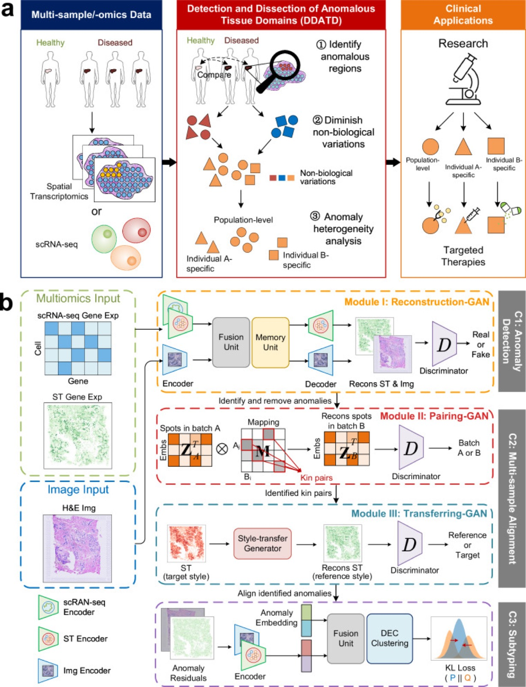
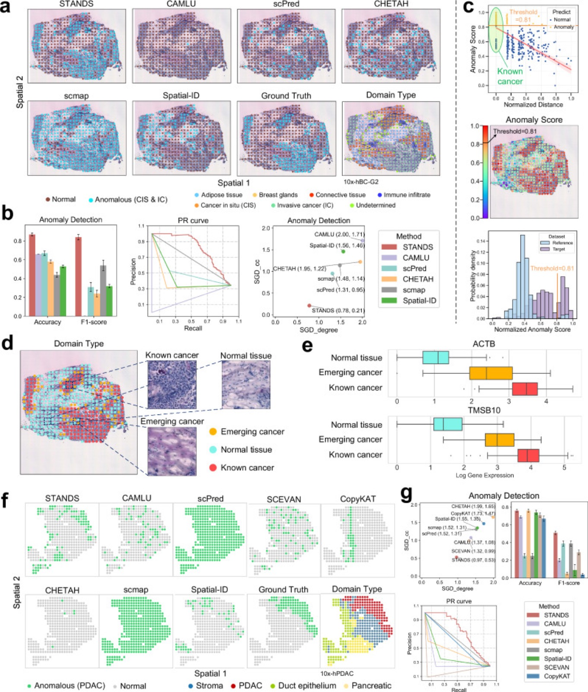
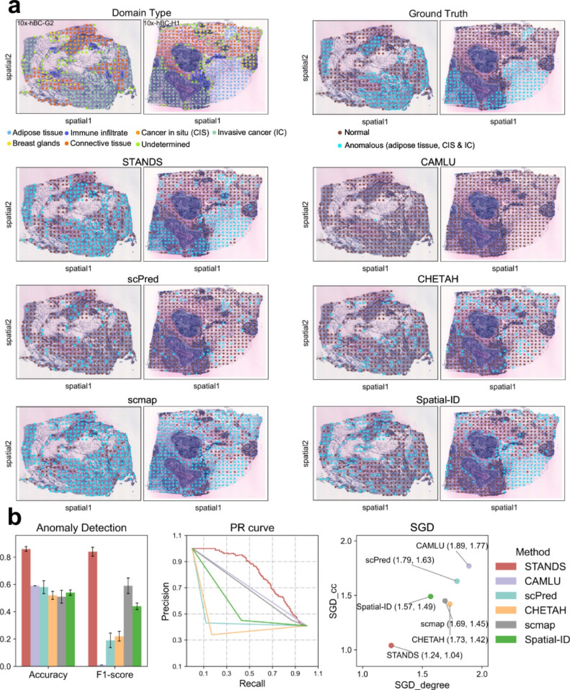
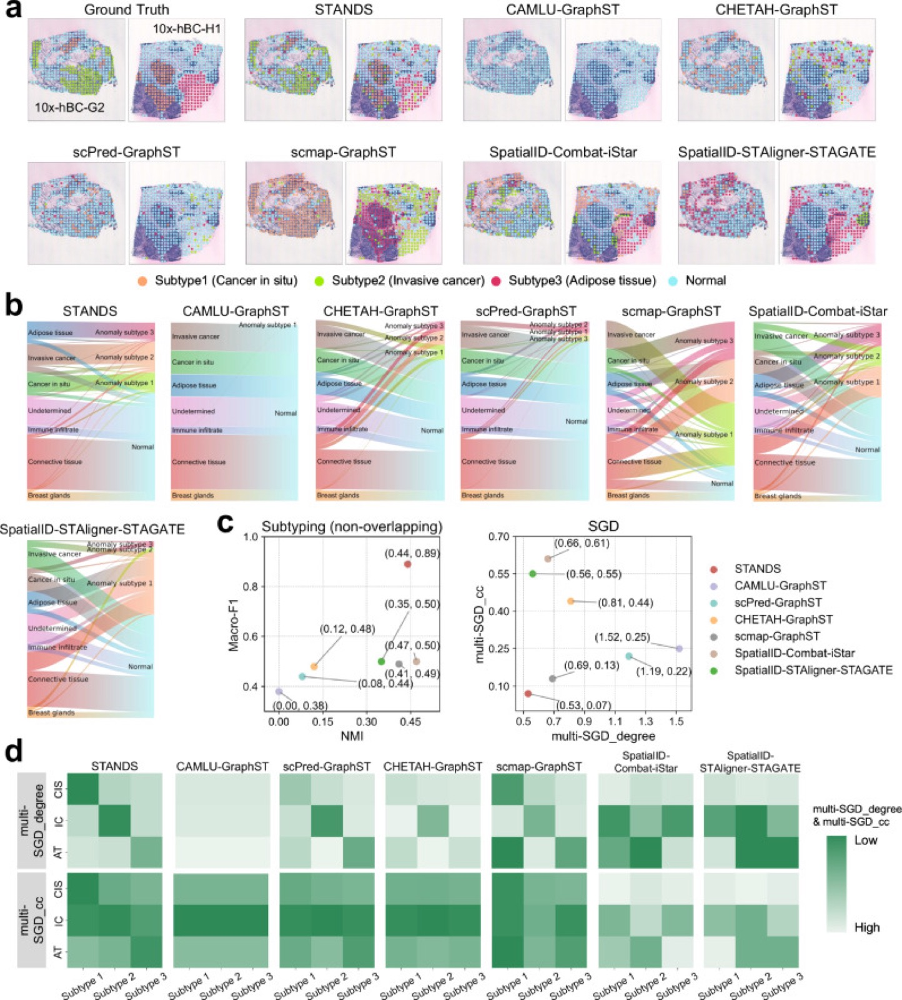

# Detecting anomalous anatomic regions in spatial transcriptomics with STANDS

> **Bibkey** `Xu_2024` · **Venue** Nature Communications (2024) · **Category** spatial · **Relevance** medium · **Access** open
> **Link** <https://doi.org/10.1038/s41467-024-52445-9> · `status: complete`

---

## One-liner
STANDS is a GAN-based multi-sample spatial-transcriptomics framework that detects, aligns, and subtypes anomalous tissue domains (ATDs) de novo — training a reconstruction model on normal tissue only and flagging high-reconstruction-error spots — without predefined anomaly markers.

## Problem
Detecting and dissecting anomalous tissue domains (DDATD) from multi-sample ST reveals both population-level and individual-specific pathogenic factors. Prior methods rely on expert visual inspection or predefined anomaly markers (useless for novel domain types), lack marker-free multi-sample alignment, and are hampered by the scarcity of normal reference ST. No prior method performed de novo DDATD in the multi-sample setting — jointly finding shared vs. sample-specific anomalies and splitting them into biologically distinct subdomains.

## Method
Three chained components: **(1) Detection (C1)** — a GAN trained on normal reference; gene expression encoded by a Graph Attention Network (GAT), histology by a GAT-ResNet hybrid, fused via a Transformer Fusion (TF) block to reconstruct normal spots; test-time spots with high reconstruction error are anomalies. A memory bank curbs mode collapse; scRNA-seq can serve as a surrogate reference when no normal ST exists (cross-modality). **(2) Alignment (C2/C3)** — a non-negative mapping matrix M builds "kin" reference↔target pairs; a learned style-divergence matrix S with style-transfer aligns targets into the reference space, correcting batch effects while preserving scale and semantics (anomalies excluded during training, realigned at test). **(3) Subtyping (C3)** — fuses C1 embeddings with reconstruction residuals and runs Discriminatively Enhanced Clustering (DEC) to split anomalies into shared or sample-specific subdomains.

## Data
Multi-platform, multi-organ: human breast (10x Visium — healthy 10x-hNB-v05 as reference; tumors 10x-hBC-G2/H1; vertical slices A1–A6); human pancreas (scRNA-seq sc-hPD reference → 10x-hPDAC PDAC, cross-modality); mouse embryo (Slide-seqV2 ssq-mEmb-32/33/34; Stereo-seq Stereo-mEmb-S1/S2/S3); human liver/pancreas (healthy liver 10x-hLCL-C73-C1 → primary sclerosing cholangitis 10x-hPSC-A1/C1/D1); human renal cell carcinoma (10x-hRCC-C2/C3/C4). Modalities: spatial gene expression plus paired histology images, with scRNA-seq supported as reference.

## Key results
Single-sample detection consistently beats Spatial-ID, CAMLU, scPred, CHETAH, scmap on accuracy and F1. Multi-sample runs capture both shared anomalies (invasive cancer across datasets) and dataset-unique ones (cancer in situ in one, adipose tissue in another). Cross-modality (scRNA-seq reference → Visium target) still yields the highest accuracy/F1 for pancreatic cancer domains. Alignment leads on iLISI/BatchKL/ASW_batch/ASW_type vs. Harmony, ComBat, GraphST, STAligner; post-alignment GraphST clustering ARI ≈ 0.23–0.52, above baselines. Subtyping tops Macro-F1, NMI, and the new Multi-SGD spatial metric. Sensitivity: dropping 1/3 of reference spots lowers AUC ~0.05–0.10; dropping 2/3 raises false positives 2–3×; removing a normal domain type (e.g., breast glands) raises that domain's false positives ~3.3× — reference diversity matters. Ablations confirm the memory bank, histology, TF block, and non-negative mapping each contribute materially.

## Contributions
- First multi-sample de novo DDATD framework: marker-free, anomaly-by-reconstruction-error on normal reference only.
- Unified GAN integrating three tasks (detect→align→subtype) with multimodal fusion (GAT expression + GAT-ResNet histology + Transformer Fusion).
- Marker-free multi-sample alignment via style-transfer + non-negative mapping that excludes unalignable ATDs before aligning.
- Cross-modality use of scRNA-seq to overcome normal-ST scarcity.
- New Spatial Grouping Discrepancy (SGD/Multi-SGD) metric incorporating spatial structure into evaluation.

## Limitations
- Strong dependence on quality/diversity of the normal reference; under-coverage sharply inflates false positives (up to ~3.3× shown).
- GAN training risks mode collapse (mitigated by memory bank); the multi-component pipeline is heavy.
- Biological meaning of detected/subtyped domains still needs downstream annotation and wet-lab support; no released pretrained checkpoints.
- Validated mainly on tumor/development/fibrosis data; generalization to broader pathologies/platforms untested.

## Relation to our direction
This sits squarely at **stage one: anomaly detection** of our pipeline, in the spatial-transcriptomics modality, and literally detects disease-altered tissue regions — highly on-topic. Its "learn normal only, flag by reconstruction error" paradigm treats normal tissue as a generative prior — a virtual-normal-tissue model — matching our virtual-tissue framing: the GAN generator is a generative prior of normal tissue and the reconstruction residual is the "degree of deviation from normal," usable directly as an anomaly score and as a localization map for revert targets. The alignment component (style-transfer + non-negative mapping) solves the multi-sample batch problem needed to separate population-level vs. individual-specific anomalies. **Directly reusable:** (a) a strong detection backbone/baseline; (b) the SGD/Multi-SGD spatially-aware eval protocol; (c) the cross-modality reference trick (scRNA-seq → ST) for normal-sample scarcity. **Gap:** it detects and subtypes but does not predict which genes, if modulated, would revert the anomaly — exactly the downstream gene-revert stage we would build on top of its residuals/generator (e.g., inverting the generator to find perturbation directions that pull anomalous spots back onto the normal manifold).

## Reusable assets
- **Code:** <https://github.com/Catchxu/STANDS> — GPL-3.0, Python 3.9+, `git clone … && python3 setup.py install`. Docs and 6 tutorials (single/multi-dataset detection, alignment, subtyping): <https://catchxu.github.io/STANDS/>.
- **Eval protocol:** Spatial Grouping Discrepancy (SGD: SGD_degree + SGD_cc) and Multi-SGD; plus a full suite of iLISI / BatchKL / ASW_batch / ASW_type / ARI / Macro-F1 / NMI.
- **Datasets:** 10x-hNB-v05, 10x-hBC-G2/H1/A1–A6, sc-hPD, 10x-hPDAC, ssq-mEmb-32/33/34, Stereo-mEmb-S1/S2/S3, 10x-hLCL-C73-C1, 10x-hPSC-A1/C1/D1, 10x-hRCC-C2/C3/C4 (accession numbers in the paper's Data availability).
- **Modules:** GAT expression encoder, GAT-ResNet histology encoder, Transformer Fusion block, memory-bank GAN, non-negative mapping alignment, style-transfer, DEC subtyping clustering — all reusable as separate components.
- **Checkpoints:** Docs recommend pretraining on large-scale public ST, but no ready-made weights are released (need to pretrain yourself).

## Follow-ups
- Read supplementary for exact M/S losses and style-transfer training.
- Run the repo tutorials; test inverting the generator/residuals into gene-revert perturbation directions.
- Compare with newer ST anomaly-detection / foundation-model methods to position STANDS as a backbone.
- Reproduce SGD/Multi-SGD and fold into our eval suite.

## Figures & tables


**Fig 1.** Overview of STANDS and multi-sample DDATD. (a) End-to-end workflow from affected samples through anomaly identification → alignment for batch correction → dissection into shared vs. sample-specific subtypes; (b) the three-component framework (C1 detection, C2 alignment, C3 subtyping) with GAT networks, GAN modules and a Transformer Fusion block.
_Source: https://pmc.ncbi.nlm.nih.gov/articles/PMC11413068/  ·  License: CC BY 4.0_


**Fig 2.** Intra- and cross-modality ATD detection in single 10x Visium datasets. Spatial maps, accuracy / F1 / PR curves / SGD scatter, anomaly-score distributions (threshold 0.81), marker genes (ACTB, TMSB10), and cross-modality detection using an scRNA-seq reference, for human breast (10x-hBC-G2) and pancreatic (10x-hPDAC) cancer. STANDS has the lowest (best) SGD among all baselines.
_Source: https://pmc.ncbi.nlm.nih.gov/articles/PMC11413068/  ·  License: CC BY 4.0_


**Fig 3.** ATD detection across multiple human breast-cancer 10x Visium datasets (10x-hBC-G2, 10x-hBC-H1) containing both shared (invasive cancer, IC) and dataset-unique (cancer in situ CIS, adipose) domains. STANDS leads five baselines (CAMLU, scPred, CHETAH, scmap, Spatial-ID) on accuracy, F1, PR curves and SGD.
_Source: https://pmc.ncbi.nlm.nih.gov/articles/PMC11413068/  ·  License: CC BY 4.0_


**Fig 7.** Subtyping ATDs across two breast-cancer datasets with overlapping (CIS) and dataset-specific (IC, adipose) subtypes: spatial maps, Sankey label-correspondence diagrams, Macro-F1 vs NMI and multi-SGD scatterplots, and heatmaps of optimal spatial matching.
_Source: https://pmc.ncbi.nlm.nih.gov/articles/PMC11413068/  ·  License: CC BY 4.0_

### Results

**Table 1.** Spatial Grouping Discrepancy for multi-sample breast-cancer detection (values read from the Fig 3b scatter labels; lower SGD_degree / SGD_cc = better, i.e. higher spatial agreement with ground truth). STANDS is lowest on both.

| Method | SGD_degree ↓ | SGD_cc ↓ |
|---|---|---|
| **STANDS** | **1.24** | **1.04** |
| CHETAH | 1.73 | 1.42 |
| scmap | 1.69 | 1.45 |
| Spatial-ID | 1.57 | 1.49 |
| scPred | 1.79 | 1.63 |
| CAMLU | 1.89 | 1.77 |

**Table 2.** SGD for cross-modality detection (scRNA-seq reference → 10x-hPDAC pancreatic-cancer target; values from the Fig 2g scatter labels, lower is better). STANDS is lowest on both.

| Method | SGD_degree ↓ | SGD_cc ↓ |
|---|---|---|
| **STANDS** | **0.97** | **0.53** |
| SCEVAN | 1.32 | 0.99 |
| CAMLU | 1.37 | 1.08 |
| scPred | 1.52 | 1.31 |
| scmap | 1.52 | 1.31 |
| Spatial-ID | 1.55 | 1.35 |
| CopyKAT | 1.73 | 1.47 |
| CHETAH | 1.99 | 1.65 |

_Source: https://pmc.ncbi.nlm.nih.gov/articles/PMC11413068/  ·  License: CC BY 4.0. accuracy / F1 / ARI and similar metrics are presented as bar charts in the original Figs 2, 3 and 4; no text value tables are provided._

## Cite
```bibtex
@article{Xu_2024, title={Detecting anomalous anatomic regions in spatial transcriptomics with STANDS}, volume={15}, ISSN={2041-1723}, url={http://dx.doi.org/10.1038/s41467-024-52445-9}, DOI={10.1038/s41467-024-52445-9}, number={1}, journal={Nature Communications}, publisher={Springer Science and Business Media LLC}, author={Xu, Kaichen and Lu, Yan and Hou, Suyang and Liu, Kainan and Du, Yihang and Huang, Mengqian and Feng, Hao and Wu, Hao and Sun, Xiaobo}, year={2024}, month=Sept }
```


---

📄 **[AI-ready full-text extract →](ai-ready.md)**
