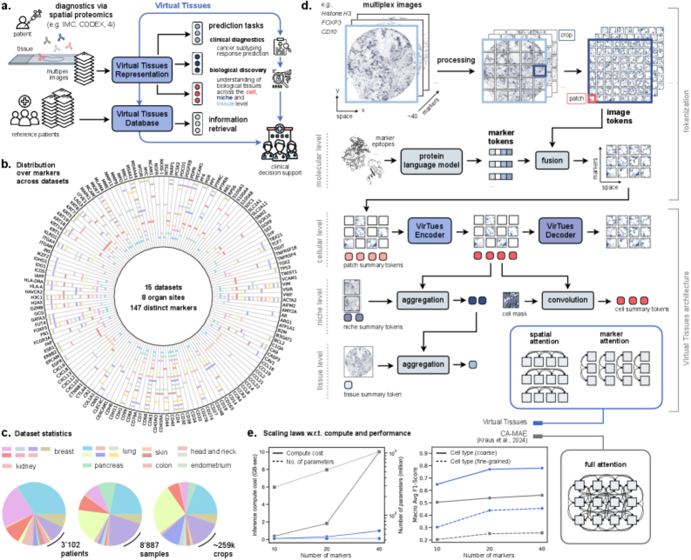
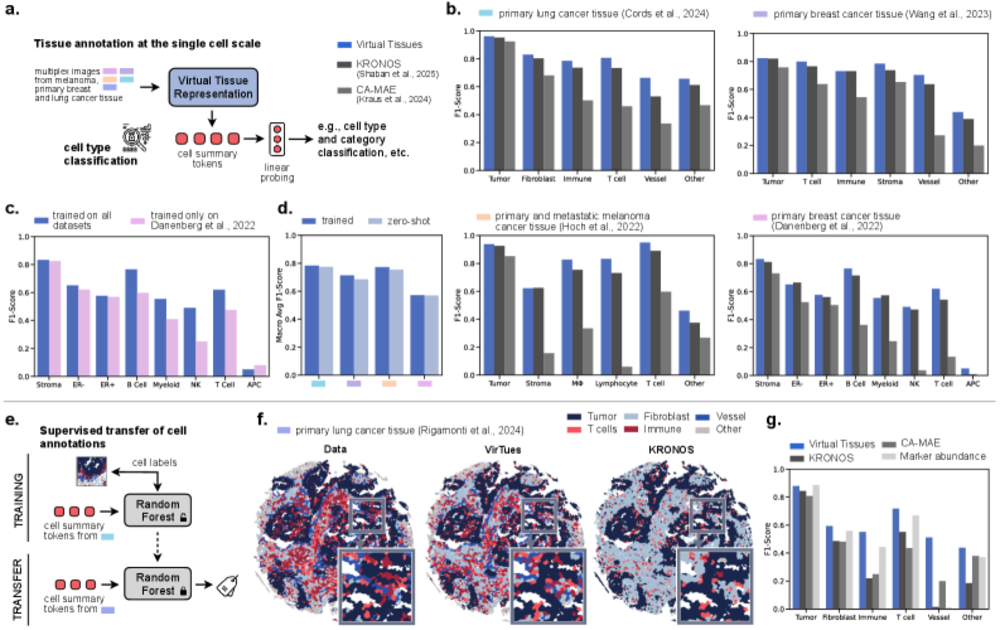
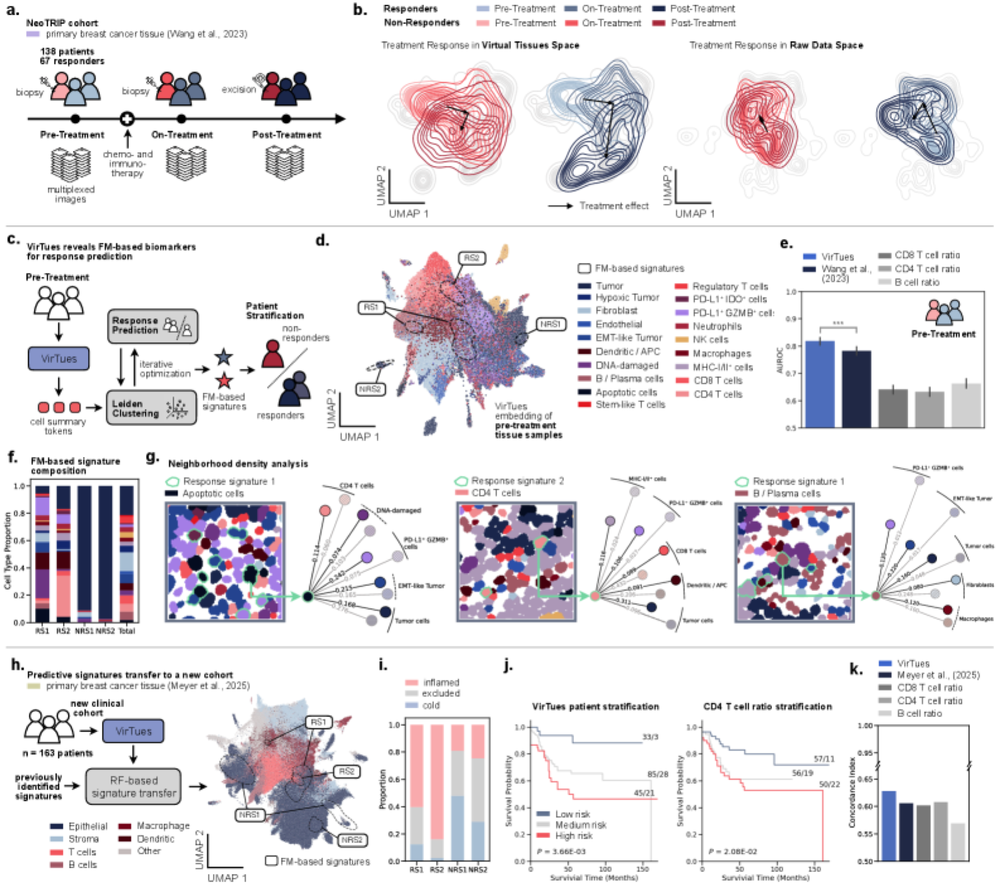

# AI-powered virtual tissues from spatial proteomics for clinical diagnostics and biomedical discovery

> **Bibkey** `Wenckstern2025_250106039` · **Venue** arXiv preprint (2025) · **Category** virtual-tissue · **Relevance** high · **Access** open
> **Link** <https://arxiv.org/abs/2501.06039> · `status: complete`

---

## One-liner

VirTues (Virtual Tissues) is a marker-aware, multi-scale foundation model for spatial proteomics that injects protein-language-model (ESM-2) marker embeddings into image tokens and uses factorized spatial-vs-marker attention; one pretrained backbone drives marker reconstruction, cell typing, niche annotation, biomarker discovery, and patient stratification, with zero-shot transfer across heterogeneous antibody panels.

## Problem

Multiplexed imaging measures dozens–hundreds of protein channels per section, but every study uses a different panel/protocol/platform, so marker count, identity, dynamic range and noise all differ. Existing pipelines are single-cohort/single-panel and cannot transfer knowledge across cohorts, cancer types or platforms, blocking robust biomarker discovery. The goal: a foundation model that ingests arbitrary marker combinations, unifies representations across scales (protein → cell → niche → tissue), and delivers clinical utility.

## Method

Three innovations: (1) **Marker-aware tokenization** — images are cropped into a 3-D grid of image tokens (each marker at each position) fused via linear projection + addition with ESM-2 protein-LM marker embeddings; learnable patch-summary tokens aggregate (via convolution with segmentation masks) into cell/niche/tissue summary tokens. (2) **Factorized attention** — disentangled *marker attention* (channel-only, learns inter-protein dependencies) and *spatial attention* (position-only, learns tissue architecture), escaping the quadratic spatial×channel cost of standard ViTs; accuracy keeps improving with marker depth (esp. first ~20 markers) where modality-agnostic designs plateau. (3) **Masked-autoencoder pretraining** with independent (60–100% per-channel), marker (whole-channel), and niche (whole-region) masking; the decoder reconstructs channel-wise. At inference, niche summary tokens + optimal-transport (Wasserstein) power a patient-retrieval "Virtual Tissues Database". Downstream: linear probing (cell) and ABMIL (tissue).

## Data

Trained/evaluated on **15 IMC datasets across 8 organ sites**, 147 distinct markers (proteins, PTMs, mRNAs). Scale: **3,102 patients, 8,887 tissue samples, >259k 256×256 crops, >14.5M segmented cells** (9 datasets with masks). Key cohorts: Cords et al. (lung), Wang et al. **NeoTRIP TNBC** (138 patients on atezolizumab + carboplatin + nab-paclitaxel, 67 pCR, pre/on/post timepoints), Danenberg et al. **METABRIC** breast (ER+, n=541, 21-yr follow-up), Rigamonti et al. lung (novel unseen markers for zero-shot), plus Hoch/Jackson/Meyer breast & melanoma sets. The training corpus is released as **spora**, a curated collection of 31+ spatial-proteomics datasets.

## Key results

- **Reconstruction**: mean Pearson r=0.723±0.157; zero-shot known-marker r=0.667 (vs 0.797 in-domain); independent/niche masking barely degrade (Δr=0.016 / −0.002).
- **Cell typing**: +6.31% macro-F1 over KRONOS, +65.79% over CA-MAE; full-corpus vs single-dataset boosts rare immune cells (NK +95.6%, myeloid +35.2%, T +30.4%, B +27.9%); zero-shot within ≤0.03 F1 of in-domain.
- **Tissue/clinical (ABMIL)**: lung subtype 0.856, breast ER 0.806, TNBC on-treatment response 0.714 F1 (all sig. > KRONOS).
- **Survival**: METABRIC ER+ (n=541) high/low-risk split, log-rank P<0.001.
- **TNBC anti-PD-L1 (headline)**: Leiden clustering of pre-treatment cells yields 4 signatures (RS1/RS2/NRS1/NRS2); combined model **cross-val AUROC 0.817**, +4.53% over Wang et al. (P<0.001), +23–30% over immune-ratio baselines. Transferred to independent Meyer et al. TNBC cohort for disease-free survival: low-risk (n=33) 3 events vs high-risk (n=45) 21 events, log-rank P<0.005; **c-index 0.628 > Meyer (0.606)** and all tumor/immune-ratio baselines.

## Contributions

- **Marker-aware tokenization**: injects ESM-2 protein-language-model embeddings into image tokens, letting the model ingest arbitrary marker combinations and perform zero-shot on entirely new markers (no retraining).
- **Factorized spatial/marker attention**: breaks the spatial×channel quadratic complexity of standard ViTs, scales to high-dimensional multiplex data, and the attention itself is interpretable.
- **Multi-scale hierarchical representation**: patch→cell→niche→tissue summary tokens; a single backbone covers the full molecular-to-clinical range of tasks.
- **Reusable computational layer**: the same pretrained model performs reconstruction, cell typing, niche annotation, OT patient retrieval, and cross-cohort-transferable biomarker discovery, establishing a "spatial-proteomics foundation model" paradigm.

## Limitations

- For entirely new markers with weak biochemical relationship to the training set, reconstruction/prediction degrades; "virtual marker imputation" needs calibration and uncertainty.
- Rare cell states and rare tissue structures remain hard, mainly limited by data scarcity.
- Survival analyses are mostly uncorrected models; covariate adjustment, proportional-hazards testing, and prospective validation are needed before clinical adoption.
- Attention maps are only a partial explanation, lacking causal/perturbation analysis.
- Trained on only 15 IMC cohorts and 8 organ sites; generalizability across more diseases, tissue-processing protocols, and imaging platforms remains to be verified. Currently limited to protein/RNA markers; multimodal fusion with H&E, spatial transcriptomics, metabolomics, etc. is the next step.

## Relation to our direction

This is the **foundational core reference** for our "virtual tissues" concept and sits squarely at the middle *virtual-tissue-modelling* stage, with reusable pieces for the other two stages:

- **Virtual tissue modelling (primary hit)**: VirTues literally models tissue as a multi-scale, marker-aware, cross-panel "virtual tissue" (patch/cell/niche/tissue summary tokens). It is a direct backbone/baseline candidate for our tissue-representation layer; the spora corpus + HF checkpoints give ready-made pretrained representations.
- **Anomaly detection (upstream, adaptable)**: the MAE objective is a self-supervised "reconstruct-normal-tissue" framework — reconstruction error (or deviation under marker/niche masking) can be repurposed as an **anomaly score** for regions altered by disease/drug perturbation. The paper already shows responders exhibit larger cell-state distribution shifts than non-responders, i.e. perturbation-induced shifts are captured in VirTues space — exactly our "detect changed regions" goal.
- **Gene/target revert (downstream, indirect)**: VirTues does not predict gene perturbations, but its biomarker pipeline (cell embeddings → multi-resolution Leiden → patient-level cross-val scoring → transferable RS/NRS signatures) is a reusable template for reading off molecular programs tied to response/reversion; the PD-L1+GZMB+ / CD4+ T populations enriched in RS1/RS2 are candidate modulation targets, and marker-attention names the key proteins per niche as hypothesis generators.
- **Eval templates**: its zero-shot cross-panel protocol, OT patient retrieval, and cross-cohort signature transfer are all reusable evaluation designs for us.

## Reusable assets

- **Code**: official repo `github.com/bunnelab/virtues` (MIT license). Conda script builds a Python 3.12 environment; `configs/base_config` sets data/marker-embedding paths; 3 Jupyter notebooks demo reconstruction / cell phenotyping / segmentation; ships with the `spora-bench` benchmark library.
- **Pretrained checkpoints (Hugging Face Hub)**: `virtues-sp32` (32 datasets, CC BY-NC 4.0), `virtues-sp31` (31 datasets, MIT), `virtues-imc14` (14 IMC datasets, CC BY-NC 4.0).
- **Dataset**: `spora` — a curated collection of 31+ spatial-proteomics datasets, with a guide for converting custom data to the spora format plus example data.
- **Marker embeddings**: ESM-2 protein-language-model embeddings (can generate marker tokens for new antibodies).
- **Evaluation protocols**: linear-probing cell typing, ABMIL tissue-level prediction, OT/Wasserstein patient retrieval, Leiden→cross-val AUROC biomarker discovery and cross-cohort transfer (concordance-index / log-rank survival evaluation).

## Follow-ups

- Check v1 vs v2 differences: v1 reports 4 datasets / 96 markers / 2062 patients, v2 expands to 15 datasets / 147 markers / 3102 patients and adds the NeoTRIP TNBC main line — confirm which version to cite.
- Closely read the differences between KRONOS (main comparison baseline) and CA-MAE, assessing their suitability as our baseline.
- Reproduce `virtues-sp31` (MIT, commercially friendly) zero-shot cell typing on our own IMC/mIF data.
- Validate the feasibility of "reconstruction error as anomaly score": on drug-perturbation paired samples, test whether masking-deviation aligns with known changed regions.
- Track the robustness of ESM-2 marker embeddings to antibody naming/clone differences (marker isolation degradation problem).

## Figures & tables


**Fig 1.** Platform overview and architecture: (a) two paths — Virtual Tissues Representation and Database — feeding clinical diagnostics, biological discovery and information retrieval; (b) training corpus of 15 datasets, 8 organ sites, 147 distinct markers; (c) 3,102 patients / 8,887 samples / ~259k crops; (d) marker-aware tokenization plus molecular/cell/niche/tissue summary tokens and factorized spatial/marker attention; (e) scaling laws — accuracy keeps rising with marker depth (blue VirTues vs grey full-attention CA-MAE).
_Source: https://arxiv.org/html/2501.06039v2 (x1.png)  ·  License: arXiv open (code MIT, github.com/bunnelab/virtues)_


**Fig 3.** Cell-level representation evaluation: (b) linear-probing cell-typing F1 across datasets, VirTues (blue) beating KRONOS and CA-MAE; (c) full-corpus vs single-dataset training gains on rare immune populations; (d) zero-shot (light) close to in-domain (blue); (e–g) Random-Forest transfer of cell annotations to an unseen cohort (Rigamonti lung).
_Source: https://arxiv.org/html/2501.06039v2 (x3.png)  ·  License: arXiv open_


**Fig 5.** FM-based signatures for treatment response and survival (headline): (a) pre/on/post timeline of the NeoTRIP TNBC cohort; (b) responders shift more in Virtual Tissues space than non-responders under treatment; (c–e) Leiden clustering yields 4 signatures (RS1/RS2/NRS1/NRS2), pre-treatment combined model AUROC 0.817, beating the Wang et al. spatial predictor and immune-ratio baselines; (h–k) transfer to an independent Meyer et al. cohort for disease-free-survival stratification (log-rank P=3.66e-03, concordance index 0.628).
_Source: https://arxiv.org/html/2501.06039v2 (x5.png)  ·  License: arXiv open_

### Results

**Table 1.** Tissue-level ABMIL clinical prediction (macro-F1) and biomarker / survival results, VirTues vs main baselines.

| Task / Metric | VirTues | Baseline (KRONOS / other) | Δ |
|---|---|---|---|
| Lung cancer subtyping (macro-F1) | 0.856 | KRONOS | +8.9% |
| Breast cancer ER status (macro-F1) | 0.806 | KRONOS | +14.2% |
| TNBC treatment response (macro-F1) | 0.714 (on-treatment) / 0.676 (pre-treatment) | > KRONOS | — |
| Cell typing (macro-F1, avg rel.) | best | KRONOS / CA-MAE | +6.31% / +65.79% |
| TNBC response prediction (cross-val AUROC) | 0.817 | Wang et al. 2023 spatial predictor | +4.53% (P<0.001); +23–30% vs immune-ratio |
| Disease-free survival (concordance index) | 0.628 | Meyer et al. 2025 | +0.022 (0.606) |

**Table 2.** Marker-reconstruction Pearson correlation (masked-autoencoder pretraining objective).

| Setting | Pearson r |
|---|---|
| Mean over 3 masking strategies | 0.723 ± 0.157 |
| In-domain (known markers) | 0.797 |
| Zero-shot (unseen dataset, known markers) | 0.667 |
| Δr under independent masking | +0.016 |
| Δr under niche masking | −0.002 |

## Cite
```bibtex
@misc{Wenckstern2025_250106039,
  title = {AI-powered virtual tissues from spatial proteomics for clinical diagnostics and biomedical discovery},
  author = {Johann Wenckstern and Eeshaan Jain and Yexiang Cheng and Benedikt von Querfurth and Kiril Vasilev and Matteo Pariset and Phil F. Cheng and Petros Liakopoulos and Olivier Michielin and Andreas Wicki and Gabriele Gut and Charlotte Bunne},
  year = {2025},
  eprint = {2501.06039},
  archivePrefix = {arXiv},
  url = {https://arxiv.org/abs/2501.06039}
}
```


---

📄 **[AI-ready full-text extract →](ai-ready.md)**
