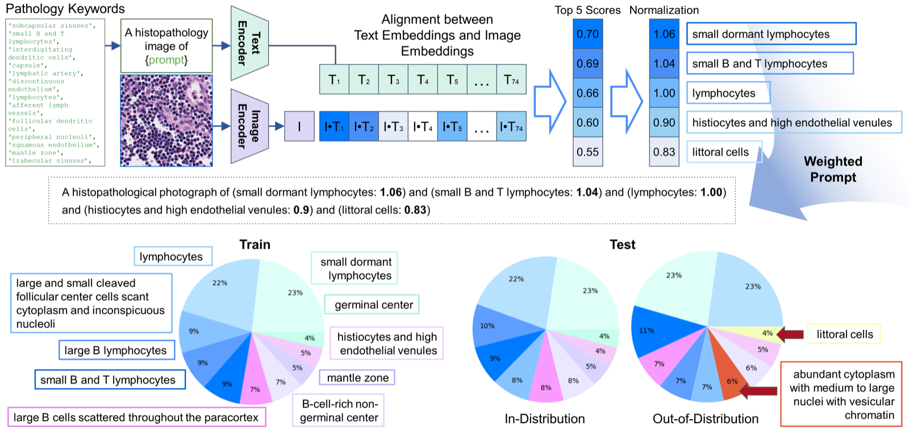

# Pathology-Informed Latent Diffusion Model for Anomaly Detection in Lymph Node Metastasis

> **Bibkey** `histo-miccai-2025` · **Venue** MICCAI 2025 (2025) · **Category** histopath · **Relevance** medium · **Access** open
> **Link** <https://papers.miccai.org/miccai-2025/0675-Paper2270.html>
> `status: complete` — 若为 abstract-only,把 PDF 放到本文件夹的 `source.pdf` 后可补全全文精读。

---

## 一句话 / One-liner
<!-- ZH --> AnoPILaD:用病理关键词提示(CONCH 视觉-语言模型选词)引导潜空间扩散模型(Stable Diffusion v1.5 + LoRA)重建"正常样"淋巴结组织,再以重建差异作为异常分数,实现无监督的转移灶检测。
<!-- EN --> AnoPILaD is a pathology-informed latent diffusion model: a VLM (CONCH) selects normal-tissue keywords that condition an LDM's reconstruction toward normal morphology, and the input-vs-reconstruction discrepancy serves as an unsupervised anomaly score for lymph-node metastasis.

## 研究问题 / Problem
<!-- 这篇论文要解决什么问题?为什么重要? / What problem, and why it matters. -->
<!-- ZH --> 数字病理中监督式转移灶检测依赖大量标注,而标注稀缺且昂贵。无监督异常检测只用正常(in-distribution)样本训练即可发现偏离正常分布的转移灶,但现有基于 DDPM 的方法(如 AnoDDPM)重建能力不足,对正常/异常分布区分度低,产生大量假阳性。本文要提升无监督重建式异常检测在淋巴结病理上的判别力与跨器官鲁棒性。
<!-- EN --> Supervised metastasis detection needs exhaustive annotation, which is scarce in digital pathology. Unsupervised reconstruction-based methods (e.g. AnoDDPM) train only on normal tissue but reconstruct poorly, yielding many false positives and weak normal/abnormal separation. The paper aims to sharpen this separation and improve cross-organ robustness.

## 方法 / Method
<!-- 核心方法、模型、数据流。关键公式/架构。 / Core method, model, data pipeline, key architecture. -->
<!-- ZH --> 核心是"病理知识提示 + 潜空间扩散重建"。(1) 骨干为 Stable Diffusion v1.5 的 LDM,用 LoRA(秩=4,lr=1e-5,batch=64)仅在正常 patch 上微调,学习正常组织的潜空间表示;训练目标为条件去噪损失 `L = E‖ε − ε_θ(z_t, t, c)‖²`,c 为文本条件。(2) 权重提示生成:从文献收集 74 个描述正常淋巴结细胞/微环境的病理关键词(经病理医师审核);推理时用 CONCH(在 117 万病理图文对上预训练的 VLM)的图像/文本编码器算余弦相似度,取 top-5 关键词,相似度除以中位数归一化得权重,经 Compel 库转成加权文本嵌入送入 LDM。(3) 异常评分沿用 AnoDDPM:对输入部分加噪到时间步 t(选定 t=674),在文本条件引导下反向去噪重建 ẑ₀ ∼ p_θ(z₀|z_{1:t}, c),输入与重建的差异即异常分数——正常样本差异小、转移样本差异大。推理用 PLMS 采样、100 步。
<!-- EN --> AnoPILaD fine-tunes a Stable Diffusion v1.5 LDM with LoRA (rank 4, lr 1e-5, batch 64) on normal patches only, with a text-conditioned denoising loss. A "weighted prompt" module takes 74 pathologist-validated normal-lymph-node keywords, uses CONCH (VLM pretrained on 1.17M pathology image-caption pairs) to pick the top-5 by cosine similarity, normalizes scores by their median for weighting, and encodes them via Compel into the LDM condition. Following AnoDDPM, an input is partially noised to timestep t (674 here) and reverse-denoised under the prompt to a "normal-like" reconstruction; input-vs-reconstruction discrepancy is the anomaly score. Inference uses a PLMS sampler with 100 steps.

## 数据 / Data
<!-- 数据集、模态、规模、来源。 / Datasets, modalities, scale, source. -->
<!-- ZH --> 两套淋巴结全切片(WSI,20× 放大,256×256 patch)。(1) 本地医院 (LH) 胃淋巴结:808 张 WSI(751 正常 / 57 转移,部分标注),训练 643 正常 WSI(1,373,475 patch),验证 50,in-distribution 测试 58,OOD 测试 57(转移);patch 级 base prevalence ≈0.40(patch)/0.50(WSI)。(2) 公开 Camelyon16 (C16) 乳腺淋巴结用于跨域独立测试:32 正常验证 / 80 正常 in-dist 测试 / 49 转移 OOD(其中 22 张肿瘤簇 >2mm,记为 C16 Macro);patch 级 OOD 55,659,prevalence ≈0.19。LH 所有肿瘤区 >2mm。
<!-- EN --> Two lymph-node WSI datasets at 20× (256×256 patches). LH (local hospital gastric): 808 WSIs (751 normal / 57 metastasis); train 643 normal WSIs = 1.37M patches, val 50, in-dist test 58, OOD test 57. C16 (Camelyon16 breast, public) for domain-shift testing: 32 val / 80 in-dist / 49 metastasis WSIs (22 with tumor clusters >2mm = "C16 Macro"); 55,659 OOD patches.

## 主要结果 / Key results
<!-- 关键指标与结论,尽量带数字。 / Headline metrics and conclusions, with numbers where possible. -->
<!-- ZH --> Patch 级异常检测(Table 2):AnoPILaD 全面领先。LH 上 AUC 0.9587 / AUPR 0.9499(次优 MemAE 0.9290/0.8886,AnoDDPM 仅 0.8555/0.7841);跨域 C16 上 AUC 0.8884 / AUPR 0.6987,比 AE/MemAE(约 0.66 AUC)高出约 0.22 AUC,显示强跨器官鲁棒性。WSI 级(Table 3):分类 AnoPILaD 在 LH 达 AUC 0.9943 / AUPR 0.9948(Z99),C16 0.6745(Zmax),C16 Macro AUC 0.8062——其余模型 Macro 上仅约 0.5–0.6。分割上 AnoPILaD 在所有场景 DICE/IoU/TNR 最高(C16 Macro DICE 0.5420 vs AnoDDPM 0.3131),而 AE/MemAE 分类尚可但分割极差(热图对全片打分近似均匀,定位能力弱)。定性上文本引导让 OOD 重建出更均匀的淋巴细胞排列、抑制多形核与纤维化,拉大正常/异常边界。
<!-- EN --> Patch-level (Table 2): AnoPILaD LH AUC 0.9587 / AUPR 0.9499; C16 AUC 0.8884 / AUPR 0.6987, ~0.22 AUC above AE/MemAE under domain shift. WSI-level (Table 3): LH classification AUC up to 0.9943 (Z99); C16 Macro AUC ~0.806 vs ~0.5-0.6 for others. Segmentation: AnoPILaD best DICE/IoU/TNR everywhere (C16 Macro DICE 0.5420 vs AnoDDPM 0.3131); AE/MemAE classify okay but localize poorly (near-uniform heatmaps).

## 创新点 / Contributions
- <!-- ZH --> 首次将病理专用 VLM(CONCH)与潜空间扩散重建结合用于病理异常检测,用**正常组织关键词**作为文本条件引导重建方向。 <!-- EN --> Couples a pathology VLM (CONCH) with an LDM, using normal-tissue keyword prompts as an inductive bias for reconstruction-based anomaly detection.
- <!-- ZH --> 提出"加权提示生成":74 个病理医师审核的正常关键词 + CONCH 相似度 top-5 + 中位数归一化权重 + Compel 加权嵌入。 <!-- EN --> A weighted-prompt module: 74 validated keywords, CONCH top-5 selection, median-normalized weights, Compel encoding.
- <!-- ZH --> 系统评测跨器官域偏移(胃→乳腺),证明文本引导显著提升鲁棒性;并强调分割(定位)而非仅分类才是异常检测的关键评价。 <!-- EN --> Demonstrates cross-organ (gastric→breast) robustness and argues segmentation/localization, not just classification, is the meaningful anomaly-detection metric.

## 局限 / Limitations
- <!-- ZH --> 跨域性能仍大幅下降(C16 WSI AUC 从 LH 的 ~0.99 掉到 ~0.67),绝对分割 DICE 偏低(C16 Macro 0.54),离临床可用尚有距离。 <!-- EN --> Large cross-domain drop remains (C16 WSI AUC ~0.67 vs LH ~0.99); absolute segmentation DICE still modest (0.54 on C16 Macro).
- <!-- ZH --> 关键词池靠人工从文献收集且面向淋巴结,迁移到其他器官需重建词表;未做提示词数量/来源的消融。 <!-- EN --> Keyword pool is hand-curated and lymph-node-specific; no ablation on prompt count/source; new organs need a new vocabulary.
- <!-- ZH --> 仅两器官、单一(部分为本地私有)数据集验证;重建时间步 t=674 依赖 LH 验证集调参,可能过拟合该分布。 <!-- EN --> Only two organs / partly-private data; reconstruction timestep t=674 tuned on LH may not transfer.

## 与本研究方向的关系 / Relation to our direction
<!-- anomaly detection → virtual tissue → revert via gene prediction 这条线上,这篇处在哪一环?能复用什么? -->
<!-- ZH --> 直接落在我们 pipeline 的**第一环:anomaly detection**,而且几乎是理想模板——用生成式模型只在"正常"组织上建模,把疾病(转移)区域当作偏离正常分布的 OOD 来检测并**定位**(z-score 热图 + 分割),这正是"检测因疾病/扰动而改变的区域"。其"重建成正常样 + 差异即异常"的思路,可视为**virtual tissue(虚拟正常组织)**在像素/潜空间层面的雏形:模型把异常样本"revert"回正常形态,差异图直接给出扰动位置——与我们"把异常 revert 回正常"的目标同构,只是发生在图像域而非基因域。可迁移的机制:(1) 用病理/组学 foundation model 的文本或先验条件去引导生成,把"正常态"知识注入重建;(2) CONCH 关键词加权提示的做法可类比到 spatial-omics 上——用 marker/pathway 词表条件化虚拟组织生成。它不涉及基因层的 revert 预测(第三环),但为"如何客观定义并定位异常"提供了可复用的评测范式(patch/WSI 级 AUC/AUPR + DICE/IoU/TNR)。
<!-- EN --> Squarely at stage 1 (anomaly detection) of our pipeline, and a near-ideal template: model only normal tissue generatively, treat disease/metastasis as OOD, and both detect and localize it via z-score heatmaps + segmentation. Its "reconstruct-to-normal, discrepancy = anomaly" scheme is an image-domain prototype of a virtual (normal) tissue that reverts an abnormal sample to normal morphology, structurally analogous to our "revert the anomaly" goal but in pixels rather than genes. Reusable ideas: (1) conditioning a generative normal-tissue model on foundation-model priors/text; (2) the CONCH weighted-keyword prompting could map onto spatial-omics by conditioning on marker/pathway vocabularies. It does not do gene-level revert prediction (stage 3) but offers a concrete localization/eval protocol.

## 可复用资产 / Reusable assets
<!-- 代码、预训练模型、数据集、评测协议。 / Code, checkpoints, datasets, eval protocols. -->
<!-- ZH -->
- **代码**:<https://github.com/QuIIL/AnoPILaD>(MIT 许可)。含 `image_caption.py`(CONCH 生成/选词)、`train_text_to_image_lora.py`(LoRA 微调 SD v1.5)、`rec_generate.py`(重建+异常评分)。依赖 HuggingFace `diffusers`、CONCH、`compel`、CFG++ solver;`conda python=3.11`。
- **无发布 checkpoint**:README 未提供预训练权重下载,需自行在正常数据上微调。
- **数据**:Camelyon16 (C16) 公开可复现跨域实验;LH 胃淋巴结为本地私有,不公开。
- **评测协议(可直接借用)**:patch 级 z-score → AUC/AUPR;WSI 级用 Zmax 与 Z99(99 分位)两种打分 + 形态学腐蚀(2×2);分割用 DICE/IoU(OOD)与 TNR(in-dist),阈值 0;FID 选扩散模型 checkpoint。
- **关键词资产**:74 个正常淋巴结病理关键词表 + top-5/median 归一化加权提示流程。
<!-- EN -->
- Code: <https://github.com/QuIIL/AnoPILaD> (MIT). Scripts for CONCH captioning, LoRA fine-tuning of SD v1.5, and reconstruction/anomaly scoring; deps: diffusers, CONCH, compel, CFG++ solver, python 3.11. No released checkpoints. C16 (Camelyon16) is public for reproducing the cross-domain test; LH data is private. Reusable eval protocol: patch AUC/AUPR from z-scores; WSI Zmax & Z99 scoring with 2×2 erosion; DICE/IoU + TNR for localization at threshold 0; FID for checkpoint selection. Plus the 74-keyword normal-lymph-node vocabulary and weighted-prompt recipe.

## 待读 / Follow-ups
- <!-- ZH --> AnoDDPM(Wyatt 2022)与 Linmans 2024《Diffusion models for OOD detection in digital pathology》(Med Image Anal 93:103088)——本文直接基线与病理 DDPM 前身。 <!-- EN --> AnoDDPM (Wyatt 2022) and Linmans 2024 (Med Image Anal 93:103088), the direct baselines.
- <!-- ZH --> CONCH(Lu 2023, arXiv:2307.12914)——病理 VLM 基础,评估其嵌入能否用于 spatial-omics 条件化。 <!-- EN --> CONCH (Lu 2023, arXiv:2307.12914) as a pathology VLM to probe for omics conditioning.
- <!-- ZH --> Compel 加权提示嵌入实现细节;能否把关键词权重换成基因/marker 表达权重。 <!-- EN --> Compel weighted-embedding internals; whether keyword weights can be swapped for gene/marker expression weights.

## 图表 / Figures & tables


<!-- ZH --> **图2.**(上)加权文本提示生成流程:CONCH 的文本/图像编码器对 74 个正常关键词与输入图像算余弦相似度,取 top-5,除以中位数归一化为权重,经 Compel 组成加权提示(如 "small dormant lymphocytes: 1.06 … littoral cells: 0.83")送入 LDM;(下)训练/测试集中 top-10 高频病理关键词分布(In-distribution vs OOD)。
<!-- EN --> **Fig 2.** (Top) Weighted-prompt generation: CONCH text/image encoders score 74 normal keywords against the input by cosine similarity, take the top-5, median-normalize into weights, and Compel builds a weighted prompt (e.g. "small dormant lymphocytes: 1.06 … littoral cells: 0.83") fed to the LDM. (Bottom) Distribution of the top-10 frequent keywords in train vs test (in-distribution vs OOD).
<!-- ZH/EN --> _Source: https://papers.miccai.org/miccai-2025/paper/2270_paper.pdf (Fig. 2)  ·  License: MICCAI 2025 Open Access_


<!-- ZH --> **图1.** 扩散重建对比。对 in-distribution(第一行)与 OOD(后两行)样本,AnoDDPM 与 AnoPILaD 均试图重建"正常样"结构;文本提示引导下,AnoPILaD 生成更均匀的淋巴细胞排列、抑制多形核与纤维化,右列为所选关键词提示。
<!-- EN --> **Fig 1.** Diffusion reconstructions. For in-distribution (row 1) and OOD (rows 2-3) inputs, AnoDDPM and AnoPILaD both reconstruct "normal-like" tissue; with text prompts AnoPILaD yields more uniform lymphocytic arrangements and suppresses pleomorphic/fibrotic structure. Right column lists the selected keyword prompts.
<!-- ZH/EN --> _Source: https://github.com/QuIIL/AnoPILaD (main.png; MIT) = paper Fig. 1_


<!-- ZH --> **图3.** 四张转移切片(LH 与 C16 各两例)的 z-score 异常热图。黑色轮廓为转移标注,绿色轮廓为正常标注;括号内为每片 (Z99, DICE)。AnoPILaD 的热图对转移区定位更准、对正常区误报更少。
<!-- EN --> **Fig 3.** Z-score anomaly heatmaps for four metastasis slides (two each from LH and C16). Black contours = metastasis annotation, green = normal annotation; parentheses give per-slide (Z99, DICE). AnoPILaD localizes tumor more precisely with fewer false positives on normal tissue.
<!-- ZH/EN --> _Source: https://papers.miccai.org/miccai-2025/paper/2270_paper.pdf (Fig. 3)  ·  License: MICCAI 2025 Open Access_

### 结果表 / Results

<!-- ZH --> **表2.** Patch 级异常检测,AUC / AUPR(LH = 胃淋巴结,C16 = Camelyon16 乳腺,跨器官域偏移)。加粗为最优。
<!-- EN --> **Table 2.** Patch-level anomaly detection, AUC / AUPR (LH = gastric nodes; C16 = Camelyon16 breast, cross-organ domain shift). Bold = best.

| Method | LH AUC | LH AUPR | C16 AUC | C16 AUPR |
|---|---|---|---|---|
| NLL | 0.4982 | 0.5552 | 0.3250 | 0.1600 |
| Regret | 0.6720 | 0.6718 | 0.6480 | 0.3441 |
| LLR | 0.6078 | 0.6260 | 0.7065 | 0.4765 |
| complexity | 0.7931 | 0.7139 | 0.7752 | 0.5140 |
| f-AnoGAN | 0.2289 | 0.3377 | 0.1735 | 0.1104 |
| AE | 0.9254 | 0.8906 | 0.6584 | 0.4759 |
| MemAE | 0.9290 | 0.8886 | 0.6611 | 0.4880 |
| AnoDDPM | 0.8555 | 0.7841 | 0.6857 | 0.5741 |
| **AnoPILaD** | **0.9587** | **0.9499** | **0.8884** | **0.6987** |

<!-- ZH --> **表3.** WSI 级分类,每格 AUC / AUPR;两种打分:Zmax(最大 z-score)与 Z99(99 分位)。C16 Macro = 肿瘤簇 >2mm 子集。加粗为最优。
<!-- EN --> **Table 3.** WSI-level classification, each cell AUC / AUPR; two scores: Zmax (max z-score) and Z99 (99th-percentile). C16 Macro = subset with tumor clusters >2mm. Bold = best.

| Method | LH Zmax | LH Z99 | C16 Zmax | C16 Z99 | C16-Macro Zmax | C16-Macro Z99 |
|---|---|---|---|---|---|---|
| AE | 0.9622 / 0.9612 | 0.9395 / 0.9381 | 0.6612 / 0.5961 | 0.5798 / 0.5217 | 0.6398 / 0.3677 | 0.5523 / 0.2918 |
| MemAE | 0.9504 / 0.9440 | 0.9365 / 0.9382 | 0.6505 / 0.5689 | 0.5686 / 0.5313 | 0.6381 / 0.3657 | 0.5597 / 0.3141 |
| AnoDDPM | 0.7840 / 0.6616 | 0.9383 / 0.8995 | 0.4992 / 0.3885 | 0.4551 / 0.3905 | 0.4926 / 0.2146 | 0.5119 / 0.2347 |
| **AnoPILaD** | **0.9837 / 0.9740** | **0.9943 / 0.9948** | **0.6745 / 0.6140** | **0.6367 / 0.5902** | **0.8062 / 0.5965** | **0.8023 / 0.5886** |

<!-- ZH/EN --> _Tables 2-3 source: https://papers.miccai.org/miccai-2025/paper/2270_paper.pdf (Tables 2-3)  ·  MICCAI 2025 Open Access_

## 引用 / Cite
```bibtex
% no BibTeX fetched
```
