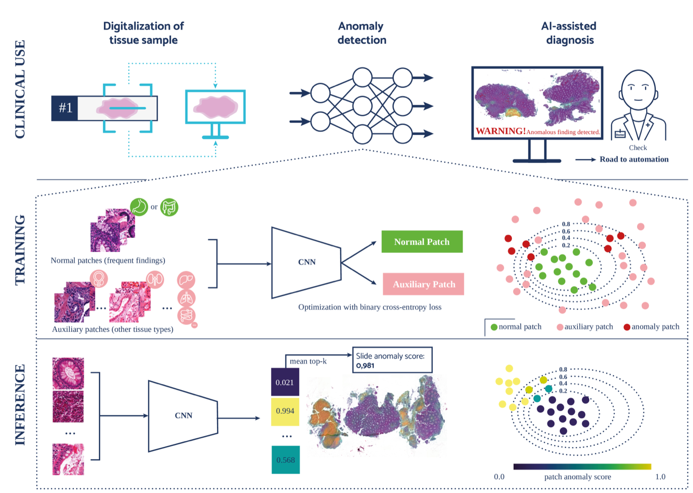
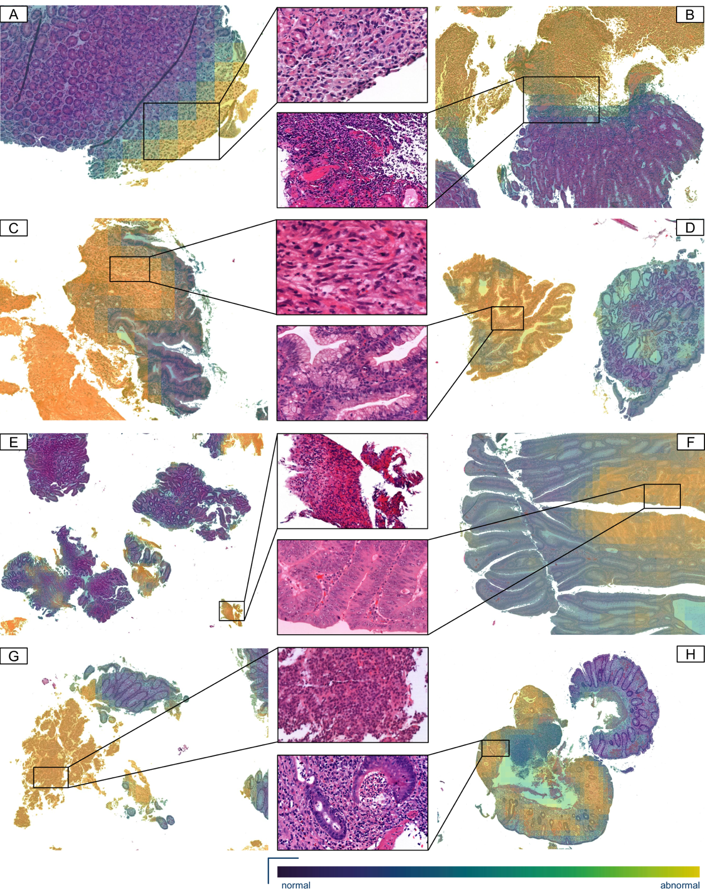
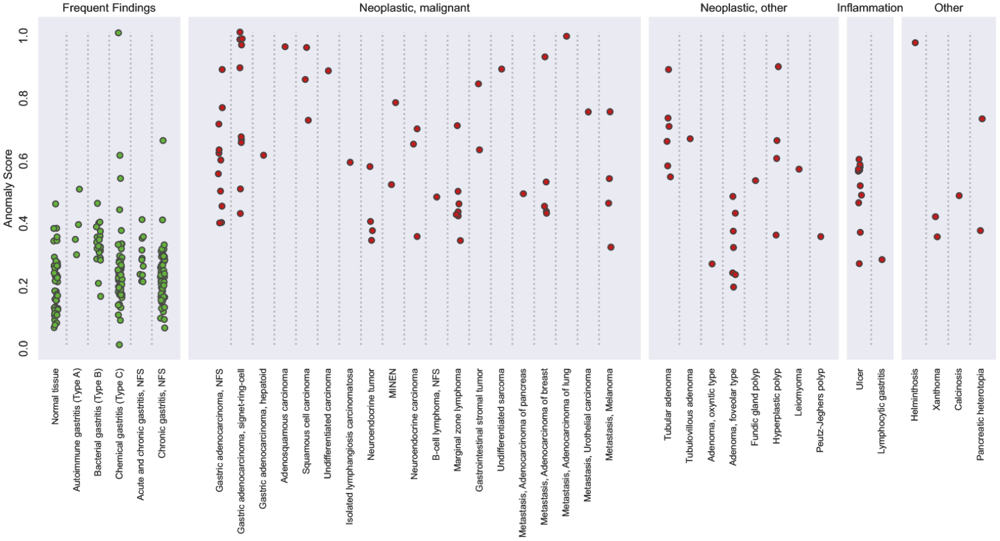
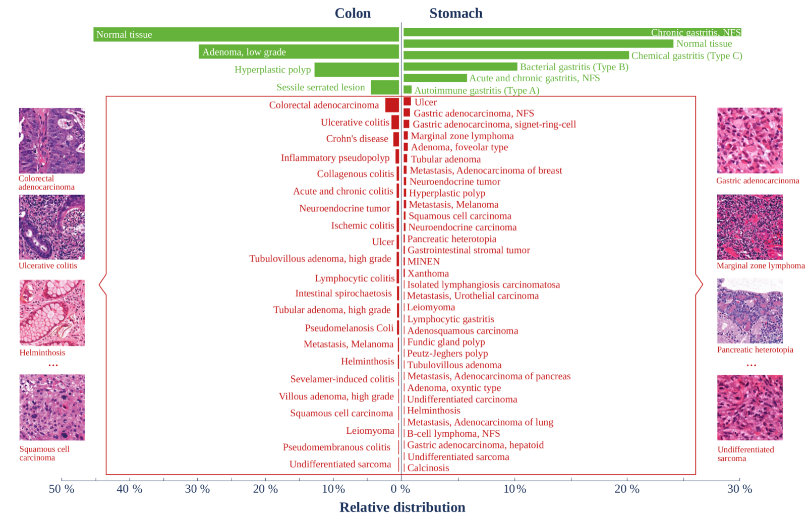

# AI-Based Anomaly Detection for Clinical-Grade Histopathological Diagnostics

> **Bibkey** `Dippel_2024` · **Venue** NEJM AI (2024) · **Category** histopath · **Relevance** high · **Access** paywall
> **Link** <https://doi.org/10.1056/aioa2400468>
> `status: abstract-only` — 若为 abstract-only,把 PDF 放到本文件夹的 `source.pdf` 后可补全全文精读。
> 注:NEJM AI 正文付费,以下细节主要取自公开 arXiv 预印本 (arXiv:2406.14866) 与作者机构新闻稿,数值与正式版可能略有差异。

---

## 一句话 / One-liner
<!-- ZH --> 只用常见病(及正常组织)训练的深度异常检测模型,无需见过罕见病样本即可在胃、结肠活检中检出长尾罕见病变,达到临床级 AUROC。
<!-- EN --> A deep anomaly-detection model trained only on common findings (and normal tissue) detects the full long tail of rare gastrointestinal pathologies it never saw during training, reaching clinical-grade AUROCs on stomach and colon biopsies.

## 研究问题 / Problem
<!-- 这篇论文要解决什么问题?为什么重要? / What problem, and why it matters. -->
<!-- ZH --> 主流病理 AI 都是有监督分类器,需要每个疾病类别有大量标注样本;但临床疾病呈长尾分布——少数常见病占绝大多数,数百种罕见病各自样本极少。有监督模型会把这些未见/少见类别漏诊或错分,这是 AI 落地临床的核心障碍。作者把问题重构为异常检测:只学习"正常/常见"的样貌,任何偏离即为需要人工复核的异常。
<!-- EN --> Supervised pathology classifiers need many labeled examples per class, but real-world disease follows a long-tail distribution: a handful of common findings dominate while hundreds of rare entities each have few or zero examples. Supervised models silently miss or misclassify these, a key barrier to safe clinical deployment. The paper reframes the task as anomaly detection: learn only what "normal/common" looks like, and flag any deviation for human review.

## 方法 / Method
<!-- 核心方法、模型、数据流。关键公式/架构。 / Core method, model, data pipeline, key architecture. -->
<!-- ZH --> 对比了两大范式:(1) 自监督特征 + 距离评分——用病理基础模型 CTransPath(在 TCGA/PAIP 32,220 张 H&E 全片上预训练的 SwinTransformer)提 patch 特征,再用改良 kNN 打异常分,或用 one-class 分类损失微调;(2) **Outlier Exposure (OE)**(最佳方案)——训练一个二分类器区分"正常 GI patch"与"辅助异质组织 patch",标准交叉熵,异常分即模型给出的异常类概率;骨干用 ResNet-18(随机初始化即可,与微调 CTransPath 相当)。切片级评分:取异常分最高的 10% patch 取均值;可视化:对重叠 patch 分数做空间平滑生成异常热图,标出可疑区域供病理医生确认。
<!-- EN --> Two paradigms are compared: (1) self-supervised features + distance scoring — patch embeddings from the pathology foundation model CTransPath (a SwinTransformer pretrained on 32,220 TCGA/PAIP H&E slides) scored with a modified kNN, or fine-tuned with a one-class loss; (2) **Outlier Exposure (OE)**, the best method — a binary classifier trained to separate normal GI patches from auxiliary out-of-domain tissue patches with plain cross-entropy, using the predicted anomaly-class probability as the score, on a ResNet-18 backbone (random init performs on par with fine-tuned CTransPath). Slide score = mean of the top-10% highest-scoring patches; anomaly heatmaps are produced by spatially averaging overlapping patch scores.

## 数据 / Data
<!-- 数据集、模态、规模、来源。 / Datasets, modalities, scale, source. -->
<!-- ZH --> 两个真实世界胃肠活检数据集,共约 1,700 万张 H&E 组织学图像、5,423 个病例。前 10 种常见诊断约占 90% 病例;其余 10% 含 56 种疾病实体,包括罕见原发癌与转移癌。主训练/评测队列来自 Charité,外部验证用 LMU 慕尼黑(不同扫描仪、不重新训练),覆盖多扫描仪、多医院。
<!-- EN --> Two real-world GI biopsy datasets: ~17 million H&E histological images across 5,423 cases. The top-10 common diagnoses cover ~90% of cases; the remaining 10% span 56 disease entities including rare primary and metastatic cancers. Primary cohort from Charité; external validation on LMU Munich (different scanner, no retraining), spanning multiple scanners and hospitals.

## 主要结果 / Key results
<!-- 关键指标与结论,尽量带数字。 / Headline metrics and conclusions, with numbers where possible. -->
<!-- ZH --> Charité 队列:胃切片 slide-AUROC 95.04%(patch-AUROC 91.37%);结肠 slide-AUROC 91.01%(patch-AUROC 90.47%)。在 100% 灵敏度(不漏异常)下,可自动放行 36.2%(胃)/ 4.21%(结肠)的正常病例免于复核。外部验证(LMU,换扫描仪、不重训):胃 94.5%、结肠 85.88% slide-AUROC。新闻稿称整体可自动处理约 25–33% 病例、其余病例辅助优先级排序、减少漏诊。
<!-- EN --> Charité: stomach slide-AUROC 95.04% (patch-AUROC 91.37%); colon slide-AUROC 91.01% (patch-AUROC 90.47%). At 100% sensitivity (no missed anomaly), 36.2% (stomach) / 4.21% (colon) of normal cases can bypass review. External validation (LMU, new scanner, no retraining): 94.5% stomach, 85.88% colon slide-AUROC. The institutional press release frames this as automating ~25–33% of cases while triaging the rest and reducing missed diagnoses.

## 创新点 / Contributions
- <!-- ZH --> 把"罕见/长尾病诊断"从有监督分类问题重构为**只需常见病数据的异常检测**问题,系统对比自监督+kNN、one-class 微调与 Outlier Exposure 三条路线。 <!-- EN --> Reframes long-tail rare-disease diagnosis as anomaly detection requiring only common-class data; systematically benchmarks self-supervised+kNN, one-class fine-tuning, and Outlier Exposure.
- <!-- ZH --> 千万级真实病例上验证,且发现随机初始化 ResNet-18 + OE 可媲美病理基础模型 CTransPath——强基线、低算力。 <!-- EN --> Validated on 17M images / 5,423 cases; finds a randomly-initialized ResNet-18 with OE rivals the CTransPath foundation model — a strong, cheap baseline.
- <!-- ZH --> 提供切片级评分 + 空间异常热图 + 明确的临床工作流(自动放行 + 优先级排序)。 <!-- EN --> Delivers slide-level scores, spatial anomaly heatmaps, and a concrete clinical workflow (auto-clear + triage).

## 局限 / Limitations
- <!-- ZH --> 结肠外部验证(85.88%)与自动放行率(4.21%)明显低于胃,跨机构/器官泛化不均。 <!-- EN --> Colon external AUROC (85.88%) and auto-clear rate (4.21%) lag stomach; cross-site/organ generalization is uneven.
- <!-- ZH --> 只做"正常 vs 异常"检测,不给出具体诊断类别;仍需病理医生确认下游。 <!-- EN --> Detects normal-vs-anomaly only; it does not name the specific diagnosis and still requires pathologist confirmation.
- <!-- ZH --> 仅 H&E、仅胃肠活检;"异常"是相对训练分布定义,分布漂移(染色/扫描仪)风险需持续监控。 <!-- EN --> H&E and GI biopsies only; "anomaly" is defined relative to the training distribution, so stain/scanner shift needs ongoing monitoring.

## 与本研究方向的关系 / Relation to our direction
<!-- anomaly detection → virtual tissue → revert via gene prediction 这条线上,这篇处在哪一环?能复用什么? -->
<!-- ZH --> 这篇是我们 pipeline **第一环(anomaly detection)在组织病理模态上的强范式参考**。它给出一个可直接迁移的核心思想:把"疾病/扰动导致的组织变化"定义为**相对正常分布的偏离**,只用正常/常见样本训练即可检出任意未见异常——正好对应我们"检测因疾病或药物扰动而改变的图像/空间组学区域"的需求。三点具体可复用:(1) **Outlier Exposure 训练配方**——用"正常 in-domain vs 异质 out-of-domain"二分类构造异常打分器,可平移到 spatial-omics patch 或细胞邻域;(2) **切片级聚合(top-10% patch 取均值)+ 空间平滑热图**,天然产出"异常区域定位",这正是后续构建 *virtual tissue* 需要圈定的兴趣区/ROI;(3) 用病理基础模型(CTransPath)做冻结特征 + 距离评分的对照,给我们"foundation-model embedding + one-class/kNN"这条更适合小样本 spatial-omics 的路线提供 baseline。它止步于"检出异常":不建模组织如何变化、也不预测 revert 基因——第二环(virtual tissue)与第三环(gene-revert)留给我们,由它的异常 ROI 喂入;即把它的异常热图 ROI 送入 virtual-tissue 建模,再做 gene-revert 预测与湿实验验证。
<!-- EN --> This is a strong paradigm reference for **stage 1 (anomaly detection) in the histopathology modality** of our pipeline. Its transferable core idea: define disease/perturbation-induced tissue change as **deviation from the normal distribution**, trainable from normal/common samples alone to catch any unseen anomaly — exactly our need to flag image/spatial-omics regions altered by disease or drug perturbation. Three concrete reusables: (1) the **Outlier Exposure recipe** (normal in-domain vs out-of-domain binary scorer) portable to spatial-omics patches or cell neighborhoods; (2) **top-10% patch aggregation + spatially-smoothed heatmaps** that natively localize anomalous ROIs — precisely the regions of interest downstream *virtual-tissue* modeling must delineate; (3) the frozen foundation-model (CTransPath) + distance-scoring comparison, a baseline for our "embedding + one-class/kNN" route better suited to low-sample spatial-omics. It stops at detection: it does not model *how* tissue changed nor predict revert genes — stages 2 (virtual tissue) and 3 (gene-revert) remain ours, fed by its anomaly ROIs.

## 可复用资产 / Reusable assets
<!-- 代码、预训练模型、数据集、评测协议。 / Code, checkpoints, datasets, eval protocols. -->
- <!-- ZH --> **方法配方**:Outlier Exposure 异常打分器(ResNet-18 骨干,cross-entropy,in-domain vs out-of-domain);top-10% patch 均值聚合;重叠 patch 空间平滑热图。 <!-- EN --> **Method recipe**: the Outlier Exposure anomaly scorer (ResNet-18 backbone, cross-entropy, in-domain vs out-of-domain); top-10% patch mean aggregation; spatially-smoothed overlapping-patch heatmaps.
- <!-- ZH --> **CTransPath**(第三方病理基础模型,公开权重,SwinTransformer,TCGA/PAIP 预训练)可作冻结特征提取器复用。 <!-- EN --> **CTransPath** (third-party pathology foundation model, public weights, SwinTransformer, pretrained on TCGA/PAIP) is reusable as a frozen feature extractor.
- <!-- ZH --> **评测协议**:slide-AUROC + patch-AUROC 双层评估;100% 灵敏度下的"自动放行率"作为临床可用性指标;跨扫描仪/跨机构外部验证(Charité→LMU,不重训)。 <!-- EN --> **Evaluation protocol**: two-level slide-AUROC + patch-AUROC assessment; the "auto-clear rate" at 100% sensitivity as a clinical-usability metric; cross-scanner/cross-site external validation (Charité→LMU, no retraining).
- <!-- ZH --> 论文/预印本:arXiv:2406.14866。**未见官方代码或数据集公开链接**(Charité/LMU 临床数据受限);建议关注作者组(TU Berlin / Aignostics,Ruff、Müller、Alber)是否放出代码。 <!-- EN --> Paper/preprint: arXiv:2406.14866. **No official code or dataset release link found** (Charité/LMU clinical data are restricted); watch the authors' group (TU Berlin / Aignostics; Ruff, Müller, Alber) for a possible code release.

## 待读 / Follow-ups
- <!-- ZH --> 核对 NEJM AI 正式版是否有额外消融/校准/前瞻数据,是否公开代码。 <!-- EN --> Check the NEJM AI version of record for extra ablations/calibration/prospective data and any code release.
- <!-- ZH --> CTransPath 原文(Wang et al.),及更强病理基础模型(UNI、Virchow、GigaPath)作 OE/one-class 特征的对比。 <!-- EN --> Read CTransPath (Wang et al.) and compare stronger foundation models (UNI, Virchow, Prov-GigaPath) as OE/one-class features.
- <!-- ZH --> Outlier Exposure 原始论文(Hendrycks et al.)与 Deep SVDD / one-class 深度异常检测综述(Ruff et al.),迁移到 spatial-omics。 <!-- EN --> Outlier Exposure (Hendrycks et al.) and deep one-class AD (Ruff et al. Deep SVDD) for transfer to spatial-omics.

## 图表 / Figures & tables

> <!-- ZH --> _NEJM AI 正文付费,以下图表全部取自公开预印本 arXiv:2406.14866,不含任何付费墙页面内容。数值/图注与正式版可能略有差异。_
> <!-- EN --> _All figures/tables below come from the OPEN preprint arXiv:2406.14866 — nothing is taken from the paywalled NEJM AI page._


<!-- ZH --> **图1.** 方法与临床流程总览:训练阶段用 Outlier Exposure 让模型区分"常见胃肠组织"与"异质辅助组织";推理阶段对每个 patch 打异常分,聚合为切片级分数并生成异常热图;临床用例中据此自动放行正常病例或为可疑病例排序供病理医生复核。
<!-- EN --> **Fig 1.** Method + clinical-workflow overview: training uses Outlier Exposure to separate frequent GI tissue from diverse auxiliary tissue; at inference each patch gets an anomaly score, aggregated to a slide-level score and rendered as an anomaly heatmap; the clinical use case auto-clears normal cases or triages suspicious ones for pathologist review.
<!-- ZH/EN --> _Source: https://arxiv.org/html/2406.14866 (Fig 2)  ·  License: arXiv preprint (arXiv:2406.14866)_


<!-- ZH --> **图2.** 胃、结肠组织的异常热图示例(腺癌、边缘区淋巴瘤、肉瘤、胃底腺腺瘤、溃疡、高级别不典型增生、神经内分泌肿瘤、炎症等):模型可准确定位病变区域,同时忽略组织褶皱等伪影。
<!-- EN --> **Fig 2.** Anomaly-heatmap examples on stomach and colon tissue (adenocarcinoma, marginal-zone lymphoma, sarcoma, foveolar adenoma, ulcer, high-grade dysplasia, neuroendocrine tumor, inflammation): the model localizes pathological regions accurately while ignoring artifacts such as tissue folds.
<!-- ZH/EN --> _Source: https://arxiv.org/html/2406.14866 (Fig 4)  ·  License: arXiv preprint (arXiv:2406.14866)_


<!-- ZH --> **图3.** OE 模型在验证集上按诊断类别给出的切片异常分分布(胃):常见/正常诊断与异常诊断之间分离明显。
<!-- EN --> **Fig 3.** Distribution of slide anomaly scores by diagnostic category (stomach), OE model on validation data: clear separation between frequent/normal findings and anomalous diagnoses.
<!-- ZH/EN --> _Source: https://arxiv.org/html/2406.14866 (Fig 3)  ·  License: arXiv preprint (arXiv:2406.14866)_


<!-- ZH --> **图4.** 胃肠活检诊断的长尾分布:约 90% 病例为前 10 种常见诊断(绿),其余 10% 由 56 种罕见疾病实体构成(红)——这正是本文要解决的问题设定。
<!-- EN --> **Fig 4.** Long-tail distribution of GI-biopsy diagnoses: ~90% of cases are the top-10 common findings (green), the remaining 10% span 56 rare disease entities (red) — the problem setting the paper targets.
<!-- ZH/EN --> _Source: https://arxiv.org/html/2406.14866 (Fig 1)  ·  License: arXiv preprint (arXiv:2406.14866)_

### 结果表 / Results

<!-- ZH --> **表1.** Charité 主队列上三种异常检测方案的 slide-AUROC / patch-AUROC(%,均值±标准差);Outlier Exposure 为最佳方案。
<!-- EN --> **Table 1.** Slide-AUROC / patch-AUROC (%, mean±SD) of three anomaly-detection approaches on the primary Charité cohort; Outlier Exposure is the best method.

| Method | Tissue | Slide-AUROC | Patch-AUROC |
|---|---|---|---|
| Self-supervision + kNN | Stomach | 94.95 ± 1.16 | 87.21 ± 0.36 |
| Self-supervision + kNN | Colon | 89.76 ± 0.77 | 85.09 ± 0.63 |
| Self-supervision + OCC | Stomach | 93.76 ± 1.39 | 89.73 ± 0.47 |
| Self-supervision + OCC | Colon | 88.51 ± 0.69 | 87.03 ± 0.49 |
| **Outlier Exposure** | **Stomach** | **95.04 ± 0.54** | **91.37 ± 0.34** |
| **Outlier Exposure** | **Colon** | **91.01 ± 0.69** | **90.47 ± 0.33** |
| Outlier Exposure (neoplastic malignant) | Stomach | 97.72 ± 0.44 | 95.02 ± 0.28 |
| Outlier Exposure (neoplastic malignant) | Colon | 96.97 ± 0.61 | 96.23 ± 0.27 |

<!-- ZH --> **表2.** LMU 慕尼黑外部验证队列(换扫描仪、不重新训练)的 slide-AUROC(%,均值±标准差)。
<!-- EN --> **Table 2.** External validation on the LMU Munich cohort (different scanner, no retraining), slide-AUROC (%, mean±SD).

| Method | Tissue | Slide-AUROC |
|---|---|---|
| Self-supervision + kNN | Stomach | 88.6 ± 0.1 |
| Self-supervision + kNN | Colon | 84.44 ± 0.61 |
| Self-supervision + OCC | Stomach | 89.92 ± 0.85 |
| Self-supervision + OCC | Colon | 87.43 ± 0.61 |
| **Outlier Exposure** | **Stomach** | **94.5 ± 0.93** |
| **Outlier Exposure** | **Colon** | **85.88 ± 0.94** |
| Outlier Exposure (malignancy) | Stomach | 94.77 ± 0.88 |
| Outlier Exposure (malignancy) | Colon | 95.02 ± 0.37 |

<!-- ZH/EN --> _Source: https://arxiv.org/html/2406.14866 (Tables 1 & 4)  ·  License: arXiv preprint (arXiv:2406.14866)_

## 引用 / Cite
```bibtex
@article{Dippel_2024, title={AI-Based Anomaly Detection for Clinical-Grade Histopathological Diagnostics}, volume={1}, ISSN={2836-9386}, url={http://dx.doi.org/10.1056/AIoa2400468}, DOI={10.1056/aioa2400468}, number={11}, journal={NEJM AI}, publisher={Massachusetts Medical Society}, author={Dippel, Jonas and Prenißl, Niklas and Hense, Julius and Liznerski, Philipp and Winterhoff, Tobias and Schallenberg, Simon and Kloft, Marius and Buchstab, Oliver and Horst, David and Alber, Maximilian and Ruff, Lukas and Müller, Klaus-Robert and Klauschen, Frederick}, year={2024}, month=Oct }
```
