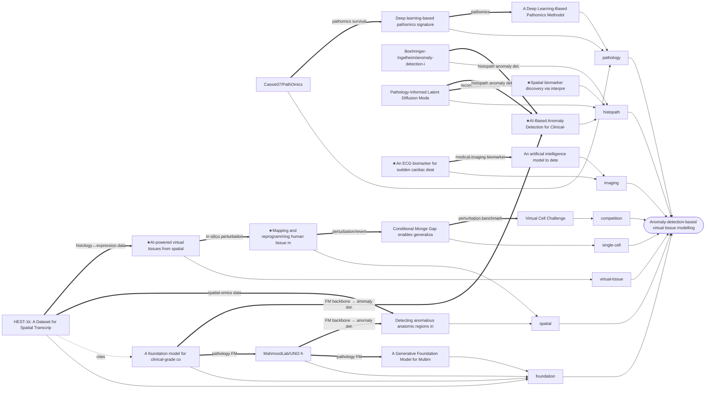

# 论文关系 / Paper relationships

> Auto-generated by `scripts/build_relationships.py`. Central node: **Anomaly-detection-based virtual tissue modelling**.
> Solid `==>` edges are curated conceptual links (shared method/data/backbone); dotted `-.->` edges are bibliographic citations within the set.

## 叙述 / How these papers relate

我们把整个研究方向拆成一条流水线,每一篇/每个资源落在其中一环:
**异常检测 (anomaly detection) → 虚拟组织建模 (virtual tissue) → 基因/扰动预测以"逆转"异常 (revert)**。
下面按流水线阶段说明它们的关系,以及跨阶段的复用关系。

We frame the direction as a pipeline —
**anomaly detection → virtual-tissue modelling → gene/perturbation prediction to *revert* the anomaly** —
and place each item in a stage, then note the cross-stage reuse.

### ① 异常检测 / Anomaly detection — 定位"变了"的区域
- **`spatial-natcommun-2024`** 在空间转录组上直接做异常解剖区域检测 — 本方向最核心的方法参照。
- **`histo-nejmai-2024`** 与 **`histo-anomaly-bi-repo`** 把异常检测搬到临床级组织病理图像(前者是方法+临床验证,后者是可直接复用的代码)。
- **`histo-sciencedirect-2026`**、**`histo-miccai-2025`** 补充组织病理方向的最新方法。
- **`imaging-ehjdh-2026`**(CT 检测异常射血分数)、**`imaging-nature-2026`**(ECG 深度学习生物标志物)提供*跨模态*的异常/生物标志物发现范式 —— 方法学可迁移,模态是心脏影像/信号。

*These define how to flag changed regions/biomarkers; the spatial-omics and histology ones are directly on-modality, the cardiac imaging ones are methodological analogues.*

### ② 虚拟组织建模 / Virtual-tissue modelling — 把组织建成可操作的模型
- **`virtual-tissue-2501`**(spatial proteomics → 虚拟组织)是"虚拟组织"概念的核心论文。
- **`spatial-biorxiv-2025`**(MintFlow)不只建模,还能*重编程*组织微环境 —— 直接连向第③环(逆转)。
- **`hest1k-2024`** 提供把组织学图像与空间转录组配对的大规模数据集,是①②两环共同的数据底座。

### ③ 逆转:基因/扰动预测 / Revert via gene & perturbation prediction
- **`scrna-natmachintell-2026`**(Conditional Monge Gap)做可泛化的单细胞扰动建模 —— 预测"扰动后细胞状态如何变",正是"逆转异常"所需的反问题工具。
- **`spatial-biorxiv-2025`** 的重编程能力在空间尺度上呼应同一目标。
- **`virtual-cell-challenge`** 是这一环的公开基准/竞赛,可用于评测我们的扰动预测模型。

### ④ 基础模型与病理应用 / Foundation backbones & pathology applications(横跨全流程)
- **`virchow-2024`**、**`uni2-h-model`**、**`fm-arxiv-2604`** 是组织病理基础模型 —— 作为①中特征提取器 / ②中表征骨干被反复复用。
- **`pathomics-npjpo-2026`**、**`pathomics-blood-2023`**、**`pathomics-repo`** 展示 pathomics(影像+组学)在预后/疗效预测上的落地,示范"图像→分子→临床"的多模态链路。

**关键跨链接 / Key cross-links:** 基础模型(④)为异常检测(①)与虚拟组织(②)提供 embedding;HEST-1k(②数据)桥接组织学与空间转录组;MintFlow(②)与 Monge-Gap(③)在"逆转/重编程"目标上汇合;竞赛(③)提供统一评测。

## 关系图 / Graph

## 概念边 / Concept edges (shared method · dataset · backbone)

| From | link | To |
|---|---|---|
| `virtual-tissue-2501` | in-silico perturbation | `spatial-biorxiv-2025` |
| `spatial-biorxiv-2025` | perturbation/revert | `scrna-natmachintell-2026` |
| `scrna-natmachintell-2026` | perturbation benchmark | `virtual-cell-challenge` |
| `hest1k-2024` | spatial-omics data | `spatial-natcommun-2024` |
| `hest1k-2024` | histology↔expression data | `virtual-tissue-2501` |
| `virchow-2024` | pathology FM | `uni2-h-model` |
| `uni2-h-model` | pathology FM | `fm-arxiv-2604` |
| `virchow-2024` | FM backbone → anomaly det. | `histo-nejmai-2024` |
| `uni2-h-model` | FM backbone → anomaly det. | `spatial-natcommun-2024` |
| `histo-miccai-2025` | reconstruct-to-normal | `histo-sciencedirect-2026` |
| `histo-miccai-2025` | histopath anomaly det. | `histo-nejmai-2024` |
| `histo-anomaly-bi-repo` | histopath anomaly det. | `histo-nejmai-2024` |
| `imaging-nature-2026` | medical-imaging biomarker | `imaging-ehjdh-2026` |
| `pathomics-repo` | pathomics survival | `pathomics-npjpo-2026` |
| `pathomics-npjpo-2026` | pathomics | `pathomics-blood-2023` |

## 引用边 / Citation edges (within this set)

| From | | To |
|---|---|---|
| `hest1k-2024` | cites | `virchow-2024` |

## 按类别 / By category

### competition
- [`virtual-cell-challenge`](../papers/virtual-cell-challenge/deep-read.md) — Virtual Cell Challenge

### foundation
- [`fm-arxiv-2604`](../papers/fm-arxiv-2604/deep-read.md) — A Generative Foundation Model for Multimodal Histopathology
- [`hest1k-2024`](../papers/hest1k-2024/deep-read.md) — HEST-1k: A Dataset for Spatial Transcriptomics and Histology Image Analysis
- [`uni2-h-model`](../papers/uni2-h-model/deep-read.md) — MahmoodLab/UNI2-h
- [`virchow-2024`](../papers/virchow-2024/deep-read.md) — A foundation model for clinical-grade computational pathology and rare cancers detection

### histopath
- [`histo-nejmai-2024`](../papers/histo-nejmai-2024/deep-read.md) — AI-Based Anomaly Detection for Clinical-Grade Histopathological Diagnostics ★
- [`histo-sciencedirect-2026`](../papers/histo-sciencedirect-2026/deep-read.md) — Spatial biomarker discovery via interpretable semantic learning in histopathology ★
- [`histo-anomaly-bi-repo`](../papers/histo-anomaly-bi-repo/deep-read.md) — Boehringer-Ingelheim/anomaly-detection-in-histology
- [`histo-miccai-2025`](../papers/histo-miccai-2025/deep-read.md) — Pathology-Informed Latent Diffusion Model for Anomaly Detection in Lymph Node Metastasis

### imaging
- [`imaging-nature-2026`](../papers/imaging-nature-2026/deep-read.md) — An ECG biomarker for sudden cardiac death discovered with deep learning ★
- [`imaging-ehjdh-2026`](../papers/imaging-ehjdh-2026/deep-read.md) — An artificial intelligence model to detect abnormal ejection fraction from non-contrast chest computed tomography: the CT–LVEF study

### pathology
- [`pathomics-blood-2023`](../papers/pathomics-blood-2023/deep-read.md) — A Deep Learning-Based Pathomics Methodology for Quantifying and Characterizing Nucleated Cells in the Bone Marrow Microenvironment
- [`pathomics-npjpo-2026`](../papers/pathomics-npjpo-2026/deep-read.md) — Deep learning-based pathomics signature predicts prognosis and treatment response in gastric cancer: a multicenter retrospective study
- [`pathomics-repo`](../papers/pathomics-repo/deep-read.md) — Cassie07/PathOmics

### single-cell
- [`scrna-natmachintell-2026`](../papers/scrna-natmachintell-2026/deep-read.md) — Conditional Monge Gap enables generalizable single-cell perturbation modelling

### spatial
- [`spatial-biorxiv-2025`](../papers/spatial-biorxiv-2025/deep-read.md) — Mapping and reprogramming human tissue microenvironments with MintFlow ★
- [`spatial-natcommun-2024`](../papers/spatial-natcommun-2024/deep-read.md) — Detecting anomalous anatomic regions in spatial transcriptomics with STANDS

### virtual-tissue
- [`virtual-tissue-2501`](../papers/virtual-tissue-2501/deep-read.md) — AI-powered virtual tissues from spatial proteomics for clinical diagnostics and biomedical discovery ★

